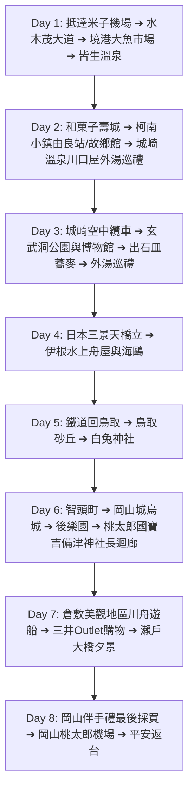

# 🇯🇵 2027 日本山陰・海之京都・山陽 8 天 7 夜

> 一月的山陰，日本海是鉛灰色的。八天走過境港的妖怪街、城崎的外湯、天橋立與伊根的舟屋、下過雪的鳥取砂丘，最後在倉敷的運河邊收尾。  
> **米子鬼太郎機場 (YGJ) 進、岡山桃太郎機場 (OKJ) 出**，由西向東一路推進，沒有一段路是走回頭的。  
> **每日交通方式（自駕／JR／巴士）尚未定案，由旅伴逐日討論拍板後確定。**  
> 景點取自 Google Maps「Want to go」收藏清單；城崎連住兩晚的「川口屋城崎河畔酒店」為指定住宿。

---

## 📌 旅程基本資訊

* **日期**：**2027 年 1 月 11 日（週一）～ 2027 年 1 月 18 日（週一）**，共 8 天 7 夜
* **成員**：6 位成人，**兩個家庭、兩間房**
* **航班資訊（台灣虎航）**：
  * **去程 (IT724)**：1/11 (一) 08:40 台北桃園 (TPE T1) ➔ 12:00 米子鬼太郎 (YGJ)
  * **回程 (IT215)**：1/18 (一) 15:25 岡山桃太郎 (OKJ) ➔ 17:30 台北桃園 (TPE T1)
* **交通方式**：**逐日由旅伴討論決定，尚未定案。**「米子機場進、岡山機場出」的開口動線已定；每日採自駕、JR 或巴士，以 [`trip_discussion.html`](./trip_discussion.html) 各日拍板的方案為準。（Day 2 目前兩個候選方案皆為 JR 山陰本線；若採自駕方案則需冬季雪胎 Studless Tires 與 ETC 卡）
* **重點名宿**：**Day 2 & Day 3 連續兩晚入住城崎溫泉【川口屋城崎河畔酒店】**。連住兩晚不必換房搬行李；**兩個家庭各一間房，旺季空房需盡早確認**。

---

## 🗂️ 專案文件導航

| 文件 | 說明 | 連結 |
| :--- | :--- | :--- |
| **📄 Word 行程企劃書** | 在討論頁按「輸出 Word 企劃書」，依當前的拍板結果產生 | [`trip_discussion.html`](./trip_discussion.html) |
| **每日行程表** | 詳細 8 天每日時間軸、動線、景點與餐飲推薦 | [`itinerary.md`](./itinerary.md) |
| **交通指南（含自駕方案）** | 航班；以及自駕方案採用時的雪胎租車守則與各景點 MapCode & 電話導航速查 | [`transportation.md`](./transportation.md) |
| **景點情報庫** | 收錄米子、境港、柯南小鎮、城崎溫泉、天橋立、伊根、鳥取砂丘、吉備津神社、倉敷等景點詳情 | [`spots.md`](./spots.md) |
| **預算與記帳** | 旅途預算試算與即時記帳追蹤 | [`budget.md`](./budget.md) |

---

## 🗺️ 8天7夜大環線概覽

---

## 📷 參考來源
* Google Maps 收藏清單：`https://maps.app.goo.gl/XTtR3CuELBJGkGSe7`
* Google Maps 收藏清單地圖截圖（米子・境港一帶收藏點）：[`截圖 2026-09-05 10.58.13.png`](./截圖%202026-09-05%2010.58.13.png)
* 指定入住飯店：`https://www.kawaguchiya.co.jp/`
* 手繪行程路線規劃圖：[`S__46088321.jpg`](./S__46088321.jpg)
