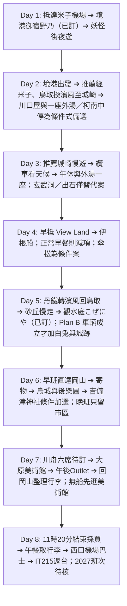

# 🇯🇵 2027 日本山陰・海之京都・山陽 8 天 7 夜

> 一月的山陰，鉛灰色的日本海，雪落在鬼太郎的肩上。  
> 從境港的妖怪街啟程，搭 JR 沿海東行；在城崎溫泉街上，穿浴衣、踏木屐，走訪六間外湯。接著前往日本三景之一的天橋立與伊根舟屋，最後在倉敷的運河邊為旅程收尾。  
> 八天、六個人，嚐松葉蟹與但馬牛，也把冬日泡到指尖發皺。  
> **米子鬼太郎機場 (YGJ) 進、岡山桃太郎機場 (OKJ) 出**，由西向東一路推進；Day 1 已確定住境港。  
> **每日交通由旅伴逐日討論拍板。** Day 1 已選境港 Plan A；營運時間與班次仍待 2027 年冬季公告確認。  
> 景點取自 Google Maps「Want to go」收藏清單；Day 1 的「御宿野乃 境港」、Day 5 的「觀水庭 こぜにや」、Day 6 & Day 7 連住的「岡山格蘭比亞酒店」均已訂，城崎連住兩晚的「川口屋城崎河畔酒店」為指定住宿。

---

## 📌 旅程基本資訊

* **日期**：**2027 年 1 月 11 日（週一）～ 2027 年 1 月 18 日（週一）**，共 8 天 7 夜；**1/11 是日本成人之日國定假日**，須以假日班表規劃。
* **成員**：6 位成人，**兩個家庭、兩間房**；6 位同行者的去回程機票均已完成訂票。
* **航班資訊（台灣虎航）**：
  * **去程 (IT724)**：1/11 (一) 08:40 台北桃園 (TPE T1) ➔ 12:00 米子鬼太郎 (YGJ)
  * **回程 (IT215)**：1/18 (一) 15:25 岡山桃太郎 (OKJ) ➔ 17:30 台北桃園 (TPE T1)
* **交通方式**：以 [`trip_discussion.html`](./trip_discussion.html) 各日拍板的方案為準。Day 1 已確定為米子空港站至境港的 JR 境線；Day 2 自境港搭境線銜接山陰本線，推薦 Plan B 於米子、鳥取轉乘，以濱風直達城崎（尚待拍板與 2027 同日接續確認）。跨日移動與冬季班次在訂房前仍須逐項確認。
* **重點名宿**：**Day 1 入住【御宿野乃 境港】已訂**；**Day 5 入住鳥取溫泉【觀水庭 こぜにや】已訂**；**Day 6 & Day 7 連住【岡山格蘭比亞酒店】已訂**；**Day 2 & Day 3 指定連住城崎溫泉【川口屋城崎河畔酒店】，訂房、兩間房、同房續住及餐食待確認**。Day 4 住宿仍須確認兩個家庭、兩間房的空房。

---

## 🗂️ 專案文件導航

| 文件 | 說明 | 連結 |
| :--- | :--- | :--- |
| **📄 Word 行程企劃書** | 在討論頁按「輸出 Word 企劃書」，依當前的拍板結果產生 | [`trip_discussion.html`](./trip_discussion.html) |
| **每日行程表** | 詳細 8 天每日時間軸、動線、景點與餐飲推薦 | [`itinerary.md`](./itinerary.md) |
| **交通指南（含自駕方案）** | 航班；以及自駕方案採用時的雪胎租車守則與各景點 MapCode & 電話導航速查 | [`transportation.md`](./transportation.md) |
| **景點情報庫** | 收錄米子、境港、柯南小鎮、城崎溫泉、天橋立、伊根、鳥取砂丘、吉備津神社、倉敷等景點詳情 | [`spots.md`](./spots.md) |
| **預算與記帳** | 旅途預算試算與即時記帳追蹤 | [`budget.md`](./budget.md) |

---

## 🗺️ 8天7夜大環線概覽

---

## 📷 參考來源
* Google Maps 收藏清單：`https://maps.app.goo.gl/XTtR3CuELBJGkGSe7`
* Google Maps 收藏清單地圖截圖（米子・境港一帶收藏點）：[`截圖 2026-09-05 10.58.13.png`](./截圖%202026-09-05%2010.58.13.png)
* 指定入住飯店：`https://www.kawaguchiya.co.jp/`
* 手繪行程路線規劃圖：[`S__46088321.jpg`](./S__46088321.jpg)
