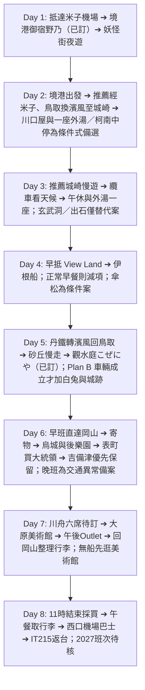

# 🇯🇵 2027 日本山陰・海之京都・山陽 8 天 7 夜

> 一月的山陰，鉛灰色的日本海，雪落在鬼太郎的肩上。  
> 從境港的妖怪街啟程，搭 JR 沿海東行；在城崎溫泉街上，穿浴衣、踏木屐，走訪六間外湯。接著前往日本三景之一的天橋立與伊根舟屋，最後在倉敷的運河邊為旅程收尾。  
> 八天、六個人，嚐松葉蟹與但馬牛，也把冬日泡到指尖發皺。  
> **米子鬼太郎機場 (YGJ) 進、岡山桃太郎機場 (OKJ) 出**，由西向東一路推進；Day 1 已確定住境港。  
> **每日交通由旅伴逐日討論拍板。** Day 1 已選境港 Plan A；營運時間與班次仍待 2027 年冬季公告確認。  
> 景點取自 Google Maps「Want to go」收藏清單；Day 1 的「御宿野乃 境港」、Day 5 的「觀水庭 こぜにや」、Day 6 & Day 7 連住的「岡山格蘭比亞酒店」均已訂，城崎的「川口屋城崎河畔酒店」已訂兩晚兩間房、含早晚餐、同房續住。

---

## 📌 旅程基本資訊

* **日期**：**2027 年 1 月 11 日（週一）～ 2027 年 1 月 18 日（週一）**，共 8 天 7 夜；**1/11 是日本成人之日國定假日**，須以假日班表規劃。
* **成員**：6 位成人，**兩個家庭、兩間房**；6 位同行者的去回程機票均已完成訂票。
* **航班資訊（台灣虎航）**：
  * **去程 (IT724)**：1/11 (一) 08:40 台北桃園 (TPE T1) ➔ 12:00 米子鬼太郎 (YGJ)
  * **回程 (IT215)**：1/18 (一) 15:25 岡山桃太郎 (OKJ) ➔ 17:30 台北桃園 (TPE T1)
* **Day 8 更新（2026-09-20）**：推薦站前收尾，11:00 結束採買、11:45–12:10 取物裝箱、12:30 前到西口 21 號站牌。12:55→13:25 僅 2026 示例，2027 待核；後一班不能預設為可用備援。大統領前晚包好安排託運，神社僅保留條件式備案。
* **Day 6–7 更新（2026-09-20；來源查核 9/19）**：第六天早班主案、吉備津優先保留；兩案均採買大統領：Plan A 12:15–13:00、Plan B 16:25–16:55，地點表町おかやま館（口味／容量／瓶數及店頭庫存待核），延誤先縮短城園。第七天維持川舟＋大原美術館＋Outlet；1/17 美術館未列年度休館，六席船票仍待訂。
* **Day 5 查核（2026-09-19）**：推薦 07:45 丹鐵→豐岡 09:12、10:37 濱風→鳥取 12:07（2026 示例，2027 待核）。中午旅館接站空檔，12:10–12:50 步行寄物、12:50–13:35 午餐；14:10 去砂丘、16:20 回。早早餐／餐盒、寄物及含餐待確認，白兔與城跡僅條件式候選。
* **Day 4 查核（2026-09-19）**：川口屋已含早餐，推薦正常早餐後出發，JR 08:58→豐岡 09:10、丹鐵 09:51→天橋立 11:05（2026 示例，2027 待核）。下午「伊根遊船／天橋立深入遊覽」待拍板；伊根版不登 View Land，13:03 去、14:30 船、15:12 回。早抵雙景僅作早餐另行確認後的條件式備案；文珠荘仍候選／待訂。
* **Day 3 查核（2026-09-19）**：推薦城崎慢遊，纜車目標 **10:10 上山、10:50／11:10 下山**；登車前有 **97 階**，接客車須經旅館另詢。海中苑本店午餐候選、13:00 午休、14:30 御所之湯優先；早晚餐已含。2027 當日外湯表與營運仍須複核。
* **Day 1 查核（2026-09-18）**：機場已公告 IT724 冬季週一 08:40→12:00。JR 假日示例 **13:09→13:24／14:11→14:26／15:13→15:28**（2026 表，2027 當日待核）；正常以 14:11 班規劃，候車空檔簡餐，寄物後 15:10～16:20 紀念館。預估 16:00 前無法入館則取消；飯店晚餐為候選，含早晚餐與寄物待核。[冬季航班](https://www.yonago-air.com/flight/taiwan)／[假日 JR 表](https://www.sakaiminato.net/wp/wp-content/uploads/2026/03/2026.03.14.pdf)。
* **交通方式**：以 [`trip_discussion.html`](./trip_discussion.html) 各日拍板的方案為準。Day 1 已確定為米子空港站至境港的 JR 境線；Day 2 自境港搭境線銜接山陰本線，推薦 Plan B 於米子、鳥取轉乘，以濱風直達城崎（尚待拍板與 2027 同日接續確認）。跨日移動與冬季班次在訂房前仍須逐項確認。
* **重點名宿**：**Day 1 入住【御宿野乃 境港】已訂**；**Day 5 入住鳥取溫泉【觀水庭 こぜにや】已訂**；**Day 6 & Day 7 連住【岡山格蘭比亞酒店】已訂**；**Day 2 & Day 3 城崎溫泉【川口屋城崎河畔酒店】已訂兩晚兩間房、含早晚餐、同房續住**。Day 4 住宿仍須確認兩個家庭、兩間房的空房。

---

## 🗂️ 專案文件導航

| 文件 | 說明 | 連結 |
| :--- | :--- | :--- |
| **📄 Word 行程企劃書** | 在討論頁按「輸出 Word 企劃書」，依當前的拍板結果產生 | [`trip_discussion.html`](./trip_discussion.html) |
| **每日行程表** | 詳細 8 天每日時間軸、動線、景點與餐飲推薦 | [`itinerary.md`](./itinerary.md) |
| **交通指南（含自駕方案）** | 航班；以及自駕方案採用時的雪胎租車守則與各景點 MapCode & 電話導航速查 | [`transportation.md`](./transportation.md) |
| **景點情報庫** | 收錄米子、境港、柯南小鎮、城崎溫泉、天橋立、伊根、鳥取砂丘、吉備津神社、倉敷等景點詳情 | [`spots.md`](./spots.md) |
| **預算與記帳** | 旅途預算試算與即時記帳追蹤 | [`budget.md`](./budget.md) |

---

## 🗺️ 8天7夜大環線概覽

---

## 📷 參考來源
* Google Maps 收藏清單：`https://maps.app.goo.gl/XTtR3CuELBJGkGSe7`
* Google Maps 收藏清單地圖截圖（米子・境港一帶收藏點）：[`截圖 2026-09-05 10.58.13.png`](./截圖%202026-09-05%2010.58.13.png)
* 指定入住飯店：`https://www.kawaguchiya.co.jp/`
* 手繪行程路線規劃圖：[`S__46088321.jpg`](./S__46088321.jpg)
