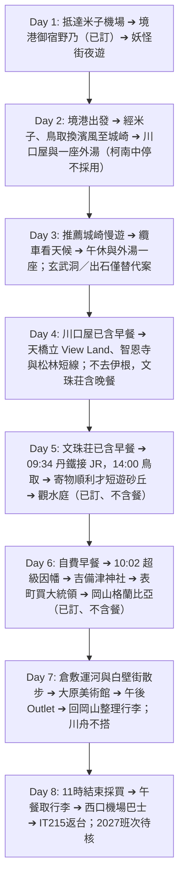

# 🇯🇵 2027 日本山陰・海之京都・山陽 8 天 7 夜

> 一月的山陰，鉛灰色的日本海，雪落在鬼太郎的肩上。  
> 從境港的妖怪街啟程，搭 JR 沿海東行；在城崎溫泉街上，穿浴衣、踏木屐，走訪六間外湯。接著前往日本三景之一的天橋立，登 View Land、走智恩寺與松林短線，最後在倉敷的運河邊為旅程收尾。  
> 八天、六個人，嚐松葉蟹與但馬牛，也把冬日泡到指尖發皺。  
> **米子鬼太郎機場 (YGJ) 進、岡山桃太郎機場 (OKJ) 出**，由西向東一路推進；Day 1 已確定住境港。  
> **每日交通由旅伴逐日討論拍板。** Day 1 已選境港 Plan A；營運時間與班次仍待 2027 年冬季公告確認。  
> 景點取自 Google Maps「Want to go」收藏清單；Day 1 的「御宿野乃 境港」、Day 5 的「觀水庭 こぜにや」、Day 6 & Day 7 連住的「岡山格蘭比亞酒店」均已訂，城崎的「川口屋城崎河畔酒店」已訂兩晚兩間房、含早晚餐、同房續住。

---

## 📌 旅程基本資訊

* **日期**：**2027 年 1 月 11 日（週一）～ 2027 年 1 月 18 日（週一）**，共 8 天 7 夜；**1/11 是日本成人之日國定假日**，須以假日班表規劃。
* **成員**：6 位成人，**兩個家庭、兩間房**；6 位同行者的去回程機票均已完成訂票。**大型行李箱共 8 件（28 吋）**，寄物、置物櫃、計程車與宅急便都以 8 件估算（2026-09-28 更新）。
* **航班資訊（台灣虎航）**：
  * **去程 (IT724)**：1/11 (一) 08:40 台北桃園 (TPE T1) ➔ 12:00 米子鬼太郎 (YGJ)
  * **回程 (IT215)**：1/18 (一) 15:25 岡山桃太郎 (OKJ) ➔ 17:30 台北桃園 (TPE T1)
* **🗓 JR 指定席開賣提醒**（乘車日一個月前同日 10:00 開賣；日本時間，台灣時間 09:00）：
  * **12/12 (六) 10:00**：Day 2 超級松風 6 號（米子→鳥取）＋濱風 4 號（鳥取→城崎），六人兩段指定席。
  * **12/16 (三) 10:00**：Day 6 超級因幡 4 號（鳥取 10:02→岡山 11:49，全車指定席），六人。
  * 可用 JR 西日本 e5489「事前受付」：開賣前一週同日 05:30 起至開賣當天 07:59 先登記，10:00 開賣時依序處理，不保證有位（Day 2 為 12/5 起、Day 6 為 12/9 起）。班次與座位以購票當時為準。

* **Day 8 更新（2026-09-20）**：推薦站前收尾，11:00 結束採買、11:45–12:10 取物裝箱、12:30 前到西口 21 號站牌。12:55→13:25 僅 2026 示例，2027 待核；後一班不能預設為可用備援。大統領前晚包好安排託運，神社僅保留條件式備案。
* **Day 6 已選 A′ 早餐版（2026-09-27）**：觀水庭住宿不含早餐，1/16 自費早餐後搭現行示例 10:02→11:49 超級因幡（全車指定席，參考 ¥5,600／人），岡山格蘭比亞寄放八件行李後午餐，13:52→14:07 去吉備津、15:47→16:05 回岡山，16:30～17:00 到表町採買大統領。岡山城、後樂園不列入已選方案；07:02 早班 A 與市區 B 只作備查。2027 班次／票價／六人座位、寄物及店頭庫存仍待核。
* **Day 7 已選倉敷（使用者確認）**：川舟不搭、不訂票；09:30 起先看大原美術館（週日趁人少），11:20～12:20 倉敷運河與白壁街區散步，午後 Outlet；鷲羽山不去；1/17 週日晚餐六人先訂位。Outlet 購物適用 2026/11/1 起的退稅制，Day 8 機場託運前辦海關確認。蒜山高原確定不去，原 Plan C 移除。現行週日 JR 08:23／08:26 發約 17 分到、¥330（2026 示例）；2027 班次待核。
* **Day 5 已選 A′ 早餐版（2026-10-02 複核）**：吃文珠荘已含早餐，搭現行示例 09:34 丹鐵、經豐岡與城崎轉 JR，14:00 到鳥取（自由席參考 ¥3,420／人，不保證六人同區座位）；午餐提前準備，不在城崎 24 分鐘轉乘時出站找店。事前先確認八件寄物流程；旅館支線須 14:15 前寄妥離館，且在 14:30 前六人到齊鳥取站乘車處，才搭 14:40→15:02 砂丘線短遊約 45 分，16:20 回；否則先去觀水庭、15:00 起入住。07:45 早班 A 與白兔計程車 B 未採用。觀水庭晚餐及次日早餐均未含；2027 班次、寄物與六人座位待核。
* **Day 5 晚餐候選順序（均未訂位）**：① 炭火焼ジュジュアン；② 焼肉牛王 鳥取駅北口店。兩家均有萬葉牛／鳥取和牛，也有不吃牛肉者可選的豬、雞、海鮮；第一家另列大山豚與鹿野地雞。實際菜色、2027/1/15 營業及六人席位待確認，觀水庭訂房不含晚餐。
* **Day 4 已選 B 天橋立（2026-10-02 修正）**：07:30～08:10 早餐、08:10～08:25 完成退房、08:30 送站。現行 08:58→豐岡 09:10、09:51→天橋立 11:05，轉乘 41 分鐘；09:33 特急版僅 9 分鐘，不列常態安排。八件先按隨人移動，接駁與寄物容量先核。11:05～11:40 文珠荘寄物、11:40～12:40 午餐、12:45～14:30 View Land、14:30～15:30 智恩寺與松林短線、15:30 入住；**不去伊根**。文珠荘已訂兩間房、含早晚餐，晚餐時段待確認；2027 列車／天候另核。
* **Day 3 修正（2026-10-02）**：仍推薦城崎慢遊、尚未代旅伴拍板。09:30 出發，纜車目標 10:30 上、11:10 下，留到 11:30 走下 97 階；12:00 午餐候選、約 13:15～13:30 回房午休，清掃完成時間需協調（清掃外可回房已確認）。14:30～16:30 步行御所之湯；搭旅館現行 15:30 首班則改約 15:30～17:00、刪減採買。18:00 晚餐已確認，第二晚おまかせ会席。2027 當日營業待核。
* **Day 1 修正（2026-10-02）**：正常參考 14:11→14:26 JR；機場以即取簡餐為主。14:30 抵御宿野乃先交寄八件行李至川口屋（**1/11 寄、目標 1/12 到，已定案**），預留 30～40 分鐘、確切截止與配送待核；不得等觀光回館才寄。紀念館改 15:35～16:20，晚到優先交寄並取消入館。17:00～17:40 入住、17:40 出發、18:00～19:30 晚餐；夜遊可刪。晚餐未含、候選未訂。
* **Day 2 修正（2026-10-02）**：採用 Plan B、兩段特急指定席；八件第一天交寄，第二天輕裝、不在退房時才寄。06:30 早餐、07:45 前抵境港站，08:05→米子、09:52 超級松風、12:56 濱風→城崎 14:11（現行示例，2027 待核）。鳥取 11:00～11:50 閘外站區魚鮮水產午餐、12:00 前回月台，不需八件置物櫃。4 分鐘鳥取轉乘不列預設備案；濱坂 2 分鐘接續亦須 JR 確認。川口屋兩晚 18:00 開席已確認；柯南中停不採用。
* **交通方式**：以 [`trip_discussion.html`](./trip_discussion.html) 各日拍板的方案為準。Day 1 已確定為米子空港站至境港的 JR 境線；Day 2 自境港搭境線銜接山陰本線，已採用 Plan B 於米子、鳥取轉乘，以濱風直達城崎（2027 同日接續待確認）。跨日移動與冬季班次在訂票及出發前仍須逐項確認。
* **重點名宿**：**Day 1 入住【御宿野乃 境港】已訂、含 Day 2 早餐、不含 Day 1 晚餐**；**Day 4 入住天橋立【和のリゾート 文珠荘】已訂 2 間房、含早晚餐**；**Day 5 入住鳥取溫泉【觀水庭 こぜにや】已訂、不含餐**；**Day 6 & Day 7 連住【岡山格蘭比亞酒店】已訂、不含餐**；**Day 2 & Day 3 城崎溫泉【川口屋城崎河畔酒店】已訂兩晚兩間房、含早晚餐、同房續住**。文珠荘 2 間房已確認，晚餐時段待確認；早晚餐已含。

### 已訂住宿餐食（2026-09-27 使用者確認）

| 住宿夜 | 住宿 | 當日晚餐 | 次日早餐 |
| :--- | :--- | :--- | :--- |
| Day 1・1/11 | 御宿 野乃境港 | 未含，自行安排 | Day 2 已含 |
| Day 2–3・1/12–13 | 川口屋城崎リバーサイドホテル | Day 2、3 均已含 | Day 3、4 均已含 |
| Day 4・1/14 | 文珠荘 | Day 4 已含 | Day 5 已含 |
| Day 5・1/15 | 観水庭こぜにや | 未含，自行安排 | Day 6 未含，自行安排 |
| Day 6–7・1/16–17 | Hotel Granvia Okayama | Day 6、7 均未含，自行安排 | Day 7、8 均未含，自行安排 |

已含與未含僅指訂房餐食；餐廳候選、旅館另外付費供餐及六人訂位仍依實際安排。

---

## 🗂️ 專案文件導航

| 文件 | 說明 | 連結 |
| :--- | :--- | :--- |
| **📄 Word 行程企劃書** | 在討論頁按「輸出 Word 企劃書」，依當前的拍板結果產生 | [`trip_discussion.html`](./trip_discussion.html) |
| **每日行程表** | 詳細 8 天每日時間軸、動線、景點與餐飲推薦 | [`itinerary.md`](./itinerary.md) |
| **交通指南（含自駕方案）** | 航班；🧳 第一段八件行李寄送已定案、後續區段待決定；以及自駕方案採用時的雪胎租車守則與各景點 MapCode & 電話導航速查 | [`transportation.md`](./transportation.md) |
| **景點情報庫** | 收錄米子、境港、柯南小鎮、城崎溫泉、天橋立、伊根、鳥取砂丘、吉備津神社、倉敷等景點詳情 | [`spots.md`](./spots.md) |
| **預算與記帳** | 旅途預算試算與即時記帳追蹤 | [`budget.md`](./budget.md) |

---

## 🗺️ 8天7夜大環線概覽

```mermaid
graph TD
    Day1[Day 1: 抵達米子機場 ➔ 境港御宿野乃（已訂）➔ 妖怪街夜遊] --> Day2[Day 2: 境港出發 ➔ 經米子、鳥取換濱風至城崎 ➔ 川口屋與一座外湯（柯南中停不採用）]
    Day2 --> Day3[Day 3: 推薦城崎慢遊 ➔ 纜車看天候 ➔ 午休與外湯一座；玄武洞／出石僅替代案]
    Day3 --> Day4[Day 4: 川口屋已含早餐 ➔ 天橋立 View Land、智恩寺與松林短線；不去伊根，文珠荘含晚餐]
    Day4 --> Day5[Day 5: 文珠荘已含早餐 ➔ 09:34 丹鐵接 JR，14:00 鳥取 ➔ 寄物順利才短遊砂丘 ➔ 觀水庭（已訂、不含餐）]
    Day5 --> Day6[Day 6: 自費早餐 ➔ 10:02 超級因幡 ➔ 吉備津神社 ➔ 表町買大統領 ➔ 岡山格蘭比亞（已訂、不含餐）]
    Day6 --> Day7[Day 7: 倉敷運河與白壁街散步 ➔ 大原美術館 ➔ 午後Outlet ➔ 回岡山整理行李；川舟不搭]
    Day7 --> Day8[Day 8: 11時結束採買 ➔ 午餐取行李 ➔ 西口機場巴士 ➔ IT215返台；2027班次待核]
```

---

## 📷 參考來源
* Google Maps 收藏清單：`https://maps.app.goo.gl/XTtR3CuELBJGkGSe7`
* Google Maps 收藏清單地圖截圖（米子・境港一帶收藏點）：[`截圖 2026-09-05 10.58.13.png`](./截圖%202026-09-05%2010.58.13.png)
* 指定入住飯店：`https://www.kawaguchiya.co.jp/`
* 手繪行程路線規劃圖：[`S__46088321.jpg`](./S__46088321.jpg)
