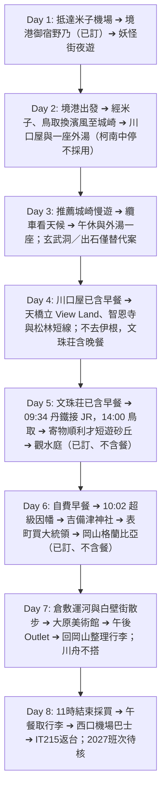

# 🇯🇵 2027 日本山陰・海之京都・山陽 8 天 7 夜

> 一月的山陰，鉛灰色的日本海，雪落在鬼太郎的肩上。  
> 從境港的妖怪街啟程，搭 JR 沿海東行；在城崎溫泉街上，穿浴衣、踏木屐，走訪六間外湯。接著前往日本三景之一的天橋立，登 View Land、走智恩寺與松林短線，最後在倉敷的運河邊為旅程收尾。  
> 八天、六個人，嚐松葉蟹與但馬牛，也把冬日泡到指尖發皺。  
> **米子鬼太郎機場 (YGJ) 進、岡山桃太郎機場 (OKJ) 出**，由西向東一路推進；Day 1 已確定住境港。  
> **每日交通由旅伴逐日討論拍板。** Day 1 已選境港 Plan A；營運時間與班次仍待 2027 年冬季公告確認。  
> 景點取自 Google Maps「Want to go」收藏清單；Day 1 的「御宿野乃 境港」、Day 5 的「觀水庭 こぜにや」、Day 6 & Day 7 連住的「岡山格蘭比亞酒店」均已訂，城崎的「川口屋城崎河畔酒店」已訂兩晚兩間房、含早晚餐、同房續住。

---

## 📌 旅程基本資訊

* **日期**：**2027 年 1 月 11 日（週一）～ 2027 年 1 月 18 日（週一）**，共 8 天 7 夜；**1/11 是日本成人之日國定假日**，須以假日班表規劃。
* **成員**：6 位成人，**兩個家庭、兩間房**；6 位同行者的去回程機票均已完成訂票。**大型行李箱共 8 件（28 吋）**，寄物、置物櫃、計程車與宅急便都以 8 件估算（2026-09-28 更新）。
* **航班資訊（台灣虎航）**：
  * **去程 (IT724)**：1/11 (一) 08:40 台北桃園 (TPE T1) ➔ 12:00 米子鬼太郎 (YGJ)
  * **回程 (IT215)**：1/18 (一) 15:25 岡山桃太郎 (OKJ) ➔ 17:30 台北桃園 (TPE T1)

* **Day 8 更新（2026-09-20）**：推薦站前收尾，11:00 結束採買、11:45–12:10 取物裝箱、12:30 前到西口 21 號站牌。12:55→13:25 僅 2026 示例，2027 待核；後一班不能預設為可用備援。大統領前晚包好安排託運，神社僅保留條件式備案。
* **Day 6 已選 A′ 早餐版（2026-09-27）**：觀水庭住宿不含早餐，1/16 自費早餐後搭現行示例 10:02→11:49 超級因幡（全車指定席，參考 ¥5,600／人），岡山格蘭比亞寄放八件行李後午餐，13:52→14:07 去吉備津、15:47→16:05 回岡山，16:30～17:00 到表町採買大統領。岡山城、後樂園不列入已選方案；07:02 早班 A 與市區 B 只作備查。2027 班次／票價／六人座位、寄物及店頭庫存仍待核。
* **Day 7 已選倉敷（使用者確認）**：川舟不搭、不訂票；09:30～10:30 倉敷美觀地區、運河與白壁街區散步，10:30 起逛大原美術館，午後 Outlet。蒜山高原確定不去，原 Plan C 移除。現行週日 JR 08:23／08:26 發約 17 分到、¥330（2026 示例）；2027 班次待核。
* **Day 5 已選 A′ 早餐版（2026-09-27）**：吃文珠荘已含早餐，搭現行示例 09:34 丹鐵、經豐岡與城崎轉 JR，14:00 到鳥取（參考 ¥3,420／人）；城崎買簡餐。八件行李若能在 14:30 前寄妥並回到鳥取站，才搭 14:40→15:02 砂丘線短遊約 45 分，16:20 回；否則直接入住觀水庭。07:45 早班 A 與白兔計程車 B 未採用。觀水庭晚餐及次日早餐均未含；2027 班次、寄物與六人座位待核。
* **Day 5 晚餐候選順序（均未訂位）**：① 炭火焼ジュジュアン；② 焼肉牛王 鳥取駅北口店。兩家均有萬葉牛／鳥取和牛，也有不吃牛肉者可選的豬、雞、海鮮；第一家另列大山豚與鹿野地雞。實際菜色、2027/1/15 營業及六人席位待確認，觀水庭訂房不含晚餐。
* **Day 4 已選 B 天橋立（使用者確認）**：保留川口屋已含早餐，搭 08:30 送站巴士；JR 08:58→豐岡 09:10、丹鐵 09:51→天橋立 11:05（現行班表 ¥1,400／人，2027 待核；想多睡可改 09:33 特急接同班，多 ¥1,290）。文珠荘寄物與午餐後，約 13:00–14:15 登 View Land、14:15–15:15 走智恩寺與松林短線，15:30 起入住；**不去伊根**。View Land 現行往返 ¥1,000／人，雪況與臨時停駛仍須查。文珠荘已訂 2 間房（2026-09-28 確認）且含 Day 4 晚餐、Day 5 早餐；晚餐時段待確認。伊根船及巴士只保留為未採用備查，不計入本次基準行程與預算。
* **Day 3 查核（2026-09-26 複核）**：推薦城崎慢遊，09:30 步行出發、纜車目標 **10:30 上山、11:10 下山**，預留六人登階與購票時間；登車前有 **97 階**，接客車須經旅館另詢。12:00 海中苑本店午餐候選、13:00 午休、14:30 御所之湯優先（可搭川口屋 15:00 送客巴士）；纜車第 2、4 週四定休，1/13 週三不受影響；鴻之湯整修預計 2026/11 重開，復業後可作備選。早晚餐已含。2027 當日外湯表與營運仍須複核。
* **Day 1 查核（2026-09-25）**：機場已公告 IT724 冬季週一 08:40→12:00。JR 假日示例 **13:09→13:24／14:11→14:26／15:13→15:28**（2026 表，2027 當日待核）；正常以 14:11 班規劃，候車空檔簡餐，寄物後 15:10～16:20 紀念館。預估 16:00 前無法入館則取消；訂房不含晚餐（9/26 確認），館內自助與站周邊海鮮餐廳待選；Day 2 早餐已含。御宿野乃[官網列入住前寄物](https://dormy-hotels.com/dormyinn/hotels/nono_sakaiminato/faq/)，但須先獲旅館同意；八件尺寸與容量先確認。[冬季航班](https://www.yonago-air.com/flight/taiwan)／[假日 JR 表](https://www.sakaiminato.net/wp/wp-content/uploads/2026/03/2026.03.14.pdf)。
* **Day 2 查核（2026-09-26）**：採用境港→米子→鳥取→城崎的 Plan B（兩段指定席、鳥取站內魚鮮水產午餐未訂位）；三段以同一平日重查現行班表（08:05→米子、09:52 超級松風、12:56 濱風→城崎 14:11），約 ¥6,870／人，2027/1/12 與六人指定席待核。濱風備案為鳥取 13:33 直達普通車（15:28 到）；城崎站前有免費入住巴士。柯南小鎮舊 Plan A 已不採用（9/26 決定）：館方[展覽文宣](https://www.gamf.jp/files/w021_2026031815461928404.pdf)預告 2026 年度冬季為搬遷閉館，[新館公告](https://www.gamf.jp/3807.html)目標 2027 年春開幕，1/12 大概率無法入館。
* **交通方式**：以 [`trip_discussion.html`](./trip_discussion.html) 各日拍板的方案為準。Day 1 已確定為米子空港站至境港的 JR 境線；Day 2 自境港搭境線銜接山陰本線，已採用 Plan B 於米子、鳥取轉乘，以濱風直達城崎（2027 同日接續待確認）。跨日移動與冬季班次在訂票及出發前仍須逐項確認。
* **重點名宿**：**Day 1 入住【御宿野乃 境港】已訂、含 Day 2 早餐、不含 Day 1 晚餐**；**Day 4 入住天橋立【和のリゾート 文珠荘】已訂 2 間房、含早晚餐**；**Day 5 入住鳥取溫泉【觀水庭 こぜにや】已訂、不含餐**；**Day 6 & Day 7 連住【岡山格蘭比亞酒店】已訂、不含餐**；**Day 2 & Day 3 城崎溫泉【川口屋城崎河畔酒店】已訂兩晚兩間房、含早晚餐、同房續住**。文珠荘 2 間房已確認，晚餐時段待確認；早晚餐已含。

### 已訂住宿餐食（2026-09-27 使用者確認）

| 住宿夜 | 住宿 | 當日晚餐 | 次日早餐 |
| :--- | :--- | :--- | :--- |
| Day 1・1/11 | 御宿 野乃境港 | 未含，自行安排 | Day 2 已含 |
| Day 2–3・1/12–13 | 川口屋城崎リバーサイドホテル | Day 2、3 均已含 | Day 3、4 均已含 |
| Day 4・1/14 | 文珠荘 | Day 4 已含 | Day 5 已含 |
| Day 5・1/15 | 観水庭こぜにや | 未含，自行安排 | Day 6 未含，自行安排 |
| Day 6–7・1/16–17 | Hotel Granvia Okayama | Day 6、7 均未含，自行安排 | Day 7、8 均未含，自行安排 |

已含與未含僅指訂房餐食；餐廳候選、旅館另外付費供餐及六人訂位仍依實際安排。

---

## 🗂️ 專案文件導航

| 文件 | 說明 | 連結 |
| :--- | :--- | :--- |
| **📄 Word 行程企劃書** | 在討論頁按「輸出 Word 企劃書」，依當前的拍板結果產生 | [`trip_discussion.html`](./trip_discussion.html) |
| **每日行程表** | 詳細 8 天每日時間軸、動線、景點與餐飲推薦 | [`itinerary.md`](./itinerary.md) |
| **交通指南（含自駕方案）** | 航班；🧳 八件行李的宅急便策略比較（待旅伴討論）；以及自駕方案採用時的雪胎租車守則與各景點 MapCode & 電話導航速查 | [`transportation.md`](./transportation.md) |
| **景點情報庫** | 收錄米子、境港、柯南小鎮、城崎溫泉、天橋立、伊根、鳥取砂丘、吉備津神社、倉敷等景點詳情 | [`spots.md`](./spots.md) |
| **預算與記帳** | 旅途預算試算與即時記帳追蹤 | [`budget.md`](./budget.md) |

---

## 🗺️ 8天7夜大環線概覽

```mermaid
graph TD
    Day1[Day 1: 抵達米子機場 ➔ 境港御宿野乃（已訂）➔ 妖怪街夜遊] --> Day2[Day 2: 境港出發 ➔ 經米子、鳥取換濱風至城崎 ➔ 川口屋與一座外湯（柯南中停不採用）]
    Day2 --> Day3[Day 3: 推薦城崎慢遊 ➔ 纜車看天候 ➔ 午休與外湯一座；玄武洞／出石僅替代案]
    Day3 --> Day4[Day 4: 川口屋已含早餐 ➔ 天橋立 View Land、智恩寺與松林短線；不去伊根，文珠荘含晚餐]
    Day4 --> Day5[Day 5: 文珠荘已含早餐 ➔ 09:34 丹鐵接 JR，14:00 鳥取 ➔ 寄物順利才短遊砂丘 ➔ 觀水庭（已訂、不含餐）]
    Day5 --> Day6[Day 6: 自費早餐 ➔ 10:02 超級因幡 ➔ 吉備津神社 ➔ 表町買大統領 ➔ 岡山格蘭比亞（已訂、不含餐）]
    Day6 --> Day7[Day 7: 倉敷運河與白壁街散步 ➔ 大原美術館 ➔ 午後Outlet ➔ 回岡山整理行李；川舟不搭]
    Day7 --> Day8[Day 8: 11時結束採買 ➔ 午餐取行李 ➔ 西口機場巴士 ➔ IT215返台；2027班次待核]
```

---

## 📷 參考來源
* Google Maps 收藏清單：`https://maps.app.goo.gl/XTtR3CuELBJGkGSe7`
* Google Maps 收藏清單地圖截圖（米子・境港一帶收藏點）：[`截圖 2026-09-05 10.58.13.png`](./截圖%202026-09-05%2010.58.13.png)
* 指定入住飯店：`https://www.kawaguchiya.co.jp/`
* 手繪行程路線規劃圖：[`S__46088321.jpg`](./S__46088321.jpg)
