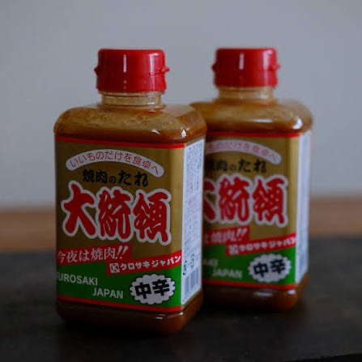

# 🗓️ 每日詳細行程表 (Detailed 8-Day Itinerary)

> **旅程企劃：2027 日本山陰・海之京都・山陽 8 天 7 夜大環線自由行**  
> **航班動線：米子鬼太郎機場 (YGJ) 進 ➔ 岡山桃太郎機場 (OKJ) 出（不走回頭路黃金動線）**  
> **成行日期：2027 年 1 月 11 日（一）～ 2027 年 1 月 18 日（一）**  
> **已整合 Google Maps「Want to go」收藏景點（青山剛昌柯南小鎮、由良車站、玄武洞博物館、鴻之湯、曼陀羅湯、吉備津神社長迴廊、三井Outlet、瀨戶大橋等）**  

> ⚠️ **行程尚未完全拍板**：不假設全程單一交通方式；以 [`trip_discussion.html`](./trip_discussion.html) 的日別方案為準。Day 1 已確定入住御宿野乃境港、採 JR 境線；Day 2 與 Day 4~8 已以 JR、路線巴士或計程車規劃。營運資訊均須在 2027 年冬季時刻表發布後重新確認。

---

## 📅 行程總覽架構表 (At a Glance)

| 天數 / 日期 | 核心停留區域 | 當日行程重點亮點 (含 Google Maps 收藏景點) | 預估移動車程 | 住宿飯店規劃 |
| :--- | :--- | :--- | :--- | :--- |
| **Day 1** 1/11 (一・成人之日) | **境港** | 抵達米子機場 (12:00) ➔ JR 境線 ➔ 御宿野乃 境港（已訂）➔ 水木茂紀念館／妖怪街夜遊 | 現行參考：JR 約 15 分 **2027 假日班表待查** | **御宿野乃 境港 已訂** |
| **Day 2** 1/12 (二) | **境港出發** 城崎溫泉 | **採用 Plan B**：境港→米子→鳥取站內午餐→城崎川口屋；濱風 4 號直達，入住後外湯一座。柯南中停（舊 Plan A）已不採用。 | **全程 JR、非全程直達**：米子、鳥取轉乘（2 次）；普通車備案鳥取 13:33 直達。 現行班表 08:05→14:11，**2027 當日接續待核** | **城崎溫泉** **川口屋城崎河畔酒店** 已訂兩晚兩間房、含早晚餐、同房續住 👑 |
| **Day 3** 1/13 (三) | **城崎溫泉** | **推薦 Plan B**：早餐 ➔ 纜車看天候 ➔ 老街午餐 ➔ 午休 ➔ 御所之湯優先、外湯一座 ➔ 川口屋晚餐。Plan A 玄武洞／出石僅作替代，不疊加。 | 步行為主，纜車可刪；外出案須另核 2027 巴士往返與開園。 | **川口屋城崎河畔酒店** 已訂連住第 2 晚；兩間房、含早晚餐、同房續住 👑 |
| **Day 4** 1/14 (四) | **海之京都** 天橋立・伊根 | **推薦 Plan B、待拍板**：早出發才排 View Land＋伊根遊覽船；正常早餐則縮減為南側散步＋伊根，或只遊天橋立。Plan A 傘松僅早抵且接續成立採用。 | **JR 城崎溫泉 ➔ 豐岡轉丹鐵 ➔ 天橋立** 伊根段丹海巴士（已公布 2026/10/1～2027/3/31 平日表，臨時異動仍查） | 天橋立（文珠） **和のリゾート 文珠荘 已訂** |
| **Day 5** 1/15 (五) | **山陰海岸** 鳥取市區 | **推薦 Plan A**：豐岡轉濱風 ➔ 寄物午餐 ➔ 砂丘慢走 ➔ 已訂旅館；晚餐依含餐條件。Plan B 車輛成立才加白兔與城跡｜**砂之美術館不入館** | 丹鐵＋濱風：現行示例 **07:45→12:07／一次轉乘**；普通車備案 **12:45 到／兩次轉乘**。2027 同日接續待核 | **鳥取溫泉 觀水庭こぜにや 已訂** |
| **Day 6** 1/16 (六) | **穿越山地** 岡山・吉備路 | **推薦早班 Plan A**：超級因幡直達 ➔ 岡山城 & 後樂園 ➔ 表町大統領採買 ➔ **吉備津神社（優先保留）**。晚班 Plan B 走岡山城、後樂園與大統領採買，不加智頭、津山或吉備津 | **JR 特急**：鳥取至岡山 現行早／晚班約 1 hr 50 min；2027 待複核 | **岡山格蘭比亞酒店（已訂）** 連住第 1 晚 |
| **Day 7** 1/17 (日) | **倉敷美觀** 三井Outlet | **推薦 Plan A**：倉敷川舟 ➔ 大原美術館 ➔ **【Google Maps】三井 OUTLET PARK 倉敷** ➔ 岡山晚餐。鷲羽山夕景僅在 2027 週日轉乘可行時加選；**Plan C 蒜山包車整日替代案**（待核） | 岡山至倉敷 JR 約 17 分；全程步行銜接 | **岡山格蘭比亞酒店（已訂）** 連住第 2 晚 |
| **Day 8** 1/18 (一) | **岡山市區** 返台 | 岡山站前商圈最後採買伴手禮 ➔ 西口 21 號站牌搭配 IT215 的利木津巴士至岡山桃太郎機場 (OKJ) ➔ 15:25 搭乘 IT215 飛往台北 ➔ 17:30 抵達桃園 | 市區至機場 巴士約 30 分（2027 班次待查） | 溫暖的家 |

---

## 📌 每日詳細動線與時間表

### Day 1：2027-01-11（週一・成人之日）｜抵達山陰 ➔ 境港御宿野乃（已訂）➔ 妖怪街夜遊

> **已確定：境港 Plan A、御宿野乃 境港（已訂）。** 六位成人以 JR 境線進境港，下午以紀念館為目標、晚餐後夜遊。**2026-09-25 查核修訂**：IT724 冬季班表已公告；JR 採 2026 假日示例，**尚非 2027/1/11 已確認班次**。本日為成人之日，不能套用平日表。

#### 建議時間表｜候車空檔午餐，寄物後逛紀念館

| 時間（抵日後為日本時間） | 安排 | 執行重點 |
| :--- | :--- | :--- |
| 08:40 台灣時間 → 12:00 日本時間 | IT724 桃園 → 米子 | 冬季官方班表已公布且吻合；六人機票已訂，最後仍以訂位通知為準。早餐出發前處理。 |
| 12:00～13:30 | 入境、領行李、洗手間與整隊 | 預留約 90 分鐘，非保證出關時間。 |
| 13:30～13:50 | 機場簡餐或補給 | 確認需等 14:11 示例班車才利用候車空檔用餐；來不及就選即取餐點，不為候餐錯過車。機場 2027/1 店家營業待核。 |
| 13:50～14:05 | 步行至米子空港站、準備乘車 | 六人加行李抓 10～15 分鐘；搭往境港方向，不先去米子站。 |
| 參考 14:11～14:26 | JR 境線：米子空港 → 境港 | 2026/3/14 改正土曜・休日示例，2027/1/11 班次待核。 |
| 14:30～14:45 | 御宿野乃寄物 | 境港站旁、步行約 1 分；現行入住 15:00 起，故先寄物不等候入住。官網列入住前可寄物，但須旅館事先同意。六件行李的尺寸與容量先確認，不把寄物視為已安排。 |
| 14:45～15:10 | 沿妖怪街走向紀念館 | 少量拍照，購物留回程。 |
| 15:10～16:20 | 水木茂紀念館 | 現行 09:30～17:00、最終入館 16:30；規劃最晚 16:00 入館。 |
| 16:20～17:00 | 妖怪街回程、購物 | 依各店營業時間調整，不把購物全部留到夜遊。 |
| 17:00～17:45 | 正式入住、休息 | 住宿已訂；餐食與入住細節依訂房確認。 |
| 17:45～19:15 | 晚餐（訂房不含） | 館內自助或站周邊海鮮餐廳待選，見下方「餐飲與費用」；外出者約 17:30 出發，均未預訂。 |
| 19:15～20:00 | 妖怪街光影散步 | 現行日落至 22:00；穿暖，風雪或疲累改附近 15～30 分鐘。 |
| 20:00 後 | 回飯店泡湯、休息 | 12 樓天然溫泉，現行大浴場 15:00～翌 10:00（三溫暖 01:00～05:00 暫停）；館方另有夜鳴きそば，時段依館內公告。Day 2 約 07:00 早餐，保留睡眠。 |

#### 早到與延誤分支

* 早到可搭現行假日示例 13:09→13:24，在境港提早午餐、增加逛街時間；正常以 14:11→14:26 規劃。錯過後下一班示例為 15:13→15:28，先比較計程車供車與等 JR 的時間。以上均為 2026 班表，2027 當日待核。
* 機場現列至境港站計程車約 15 分、¥2,400／車，僅參考、非本次報價；六人加行李須另確認台數／大型車、候車與總價，不能假設一台普通車足夠或即叫即到。機場建議提前預約。
* 旅館若無法受理六件行李，[紀念館 FAQ](https://mizuki.sakaiminato.net/faq/)列有大件寄存；六件能否同時寄放仍須先詢，採此備援須在離館時取回行李。
* **預估無法在 16:00 前進紀念館，就取消入館**，保留老街、入住、晚餐與泡湯；不追 16:30 最終入館。
* 水產直賣中心、美保關、夢港塔均不列入第一天主行程。

#### 餐飲與費用

**已訂房不含晚餐**（2026-09-26 使用者確認），晚餐另選另付；以下四案均**未預訂**，2027 營業與價格出發前複核。

| 晚餐候選 | 營業／休日（現行） | 座位與價位 | 位置與備註 |
| :--- | :--- | :--- | :--- |
| 御宿野乃館內自助 | 17:00～21:00，90 分鐘制、最後點餐 20:30 | 住宿客成人 ¥4,000，六人 ¥24,000；天婦羅、壽司可續取 | 不用再出門，最省力；供餐數量有限，須事先聯絡。[來源](https://dormy-hotels.com/dormyinn/hotels/nono_sakaiminato/breakfast/) |
| 和泉（地魚居酒屋） | 17:30～22:00；週四休（另有資料列第 4 週三休） | 23 席（吧台 11、座敷 12）；晚餐約 ¥3,000～3,999／人 | 境港站步行約 8～10 分；可網路預約、可包場。平價生魚片與海鮮。[Hot Pepper](https://www.hotpepper.jp/strJ000772698/) |
| 味処 美佐（螃蟹料理） | 17:30～22:30（最後點餐 22:00）；週日休 | 席位少、須事先預約；松葉蟹一隻套餐 ¥15,950（11/7～3 月底）、紅楚蟹一隻 ¥7,700，蟹價隨進貨浮動 | 境港站步行約 9 分。第二、三晚川口屋已含晚餐，整套螃蟹是否重複須考量。[るるぶ](https://rurubu.jp/andmore/spot/80032851)／[Hot Pepper](https://www.hotpepper.jp/strJ000111200/) |
| 海鮮ふぐ料理 殿 | 16:00～23:00；不定休 | 50 席、有包廂可包場；河豚與海鮮，價位較高 | 境港站約 850 m、步行約 15 分。[官網](https://kaisen29-tono.com/) |

1/11 是成人之日，三家餐廳的資料都沒有寫國定假日是否營業，**訂位時一併確認**。外出用餐約 17:30 從旅館出發，餐後順路接妖怪街夜遊。

**Day 2 早餐銜接**：現行早餐 06:30～09:30（最終入店 09:00，1F 和洋自助與海鮮丼），未含早餐時成人 ¥3,000／人、六人 ¥18,000。Day 2 推薦案 08:05 境港發，07:00 起用餐可行；是否含早餐以訂位為準。

**基本交通與門票**：JR ¥190＋紀念館 ¥1,000＝¥1,190／人，六人 **¥7,140**。不買周遊券；住宿、餐飲、計程車另計。若取消入館扣除門票；計程車取代 JR 時不重複加計。

**待確認**：2027/1/11 JR 班次、機場餐飲營業、旅館預先同意六件寄物、已訂方案是否含早餐、晚餐選定與六人訂位（含 1/11 假日營業）。

**官方查核來源（2026-09-25）**：[冬季航班](https://www.yonago-air.com/flight/taiwan)、[2026 假日 JR 班表（第 2 頁）](https://www.sakaiminato.net/wp/wp-content/uploads/2026/03/2026.03.14.pdf)、[JR 票價](https://www.yonago-air.com/access/train)、[機場步行與餐飲](https://www.yonago-air.com/faq)、[計程車](https://www.yonago-air.com/access/taxi)、[紀念館](https://mizuki.sakaiminato.net/information/)與[寄物 FAQ](https://mizuki.sakaiminato.net/faq/)、[妖怪街光影](https://mizuki.sakaiminato.net/road/)、[飯店餐飲](https://dormy-hotels.com/dormyinn/hotels/nono_sakaiminato/breakfast/)與[入住前寄物 FAQ](https://dormy-hotels.com/dormyinn/hotels/nono_sakaiminato/faq/)。

---

### Day 2：2027-01-12（週二）｜境港出發 ➔ 鳥取轉乘 ➔ 城崎川口屋與外湯

> **2026-09-26 複核：採用 Plan B**（2026-09-26 使用者決定：故鄉館預告冬季搬遷閉館，柯南中停不採用）。 出發地確定是「御宿野乃 境港」，上午退房後搭 JR，下午以入住城崎與一座外湯為主。川口屋已訂兩晚兩間房、含早晚餐、同房續住（2026-09-18 使用者確認）；入住 1/12、退房 1/14。現行入住 15:00～18:00，車站有旅館組合免費入住巴士；實際開席仍待確認。

#### 採用 Plan B｜銜接濱風 4 號，減少一次搬行李換車

**御宿野乃 → 境港站 → 米子站 → 鳥取站 → 城崎溫泉站 → 川口屋。** 米子至鳥取搭超級松風（六人劃指定席），鳥取至城崎搭「濱風 4 號（はまかぜ4号）」。後段可直達，經濱坂但不下車；全日仍需在米子、鳥取轉乘兩次。

以下三段已於 2026-09-26 用**同一個平日（2026/10/13）**重查，屬 2026/3/14 改正後的現行班表；JR 通常每年 3 月改正，1/12 仍在這一期內，但**不是 2027/1/12 的保證班次或訂位**，購票時以當日重查為準並確認六人座位。境線平日 08:05 是唯一接得上米子 09:52 的班次，下一班 09:18 要到 10:11 才到米子。

| 時間（日本時間） | 安排 | 執行重點 |
| :--- | :--- | :--- |
| 約 07:00～07:40 | 早餐、整理行李、退房 | 御宿野乃現行早餐 06:30 起；是否含早餐依訂位。行李可前晚先整理。 |
| 約 07:45～07:50 | 從御宿野乃前往境港站候車 | 出發前確認車票，留足六人上車時間。 |
| 參考 08:05～08:56 | JR 境線：境港 → 米子 | 普通車約 51 分鐘，境港始發。錯過就接不上 09:52 特急，見下方備案。 |
| 約 08:56～09:35 | 米子站轉乘、洗手間與補給 | 參考接續有約 56 分鐘；確認月台，約 09:35 回到乘車處。 |
| 參考 09:52～10:57 | 超級松風 6 號：米子 → 鳥取 | 普通車部分指定席；**決定六人劃指定席**，方便坐在一起。1/12 仍可選自由席（¥1,200）；JR 西日本公告 2027 年春起才全車指定席，在旅行之後。指定席車廂少（一般僅 1 號車），12/12 10:00 開賣就訂。[JR 西日本 2026/8/4 公告](https://www.westjr.co.jp/press/article/2026/08/04/page_30895.html)。特急券另計。 |
| 約 11:00～12:20 | 鳥取站周邊午餐、休息 | 留在站區，不加砂丘或市區景點。**午餐選定站內「シャミネ鳥取」的三代目網元 魚鮮水產**（2026-09-26 決定，未訂位）：現行每日 11:00～23:00，有六人半包廂桌；可電話預約 0857-36-7621。縣府資料列南口附近大型寄物櫃僅 8 格（¥700、限現金），六件大行李未必放得下，先分配輪流看行李或帶進店。12:20 左右返回車站。 |
| 參考 12:56～14:11 | 濱風 4 號：鳥取 → 城崎溫泉 | 鳥取始發、每日運行，普通車全車指定席；濱坂停車不用換車。此段不是超級白兔。 |
| 約 14:15～15:00 | 前往川口屋、寄物，附近短程散步 | 城崎溫泉站前有旅館組合的免費入住巴士，現行 12:30～18:00 運行，到川口屋約 5 分；另可把行李交站前觀光中心代送旅館（入住前 ¥200／件，09:00～17:00）。步行約 6 分為旅遊網站資料。 |
| 約 15:00～16:00 | 正式入住、休息、領外湯券 | 現行入住 15:00～18:00；確認晚餐開席與外湯營業。旅館外湯送客巴士現行 15:00、15:30、16:00、16:30、17:00 發。 |
| 約 16:00～17:15 | 外湯一座＋溫泉街散步 | 可搭 16:00 送客巴士出發；優先一之湯或曼陀羅湯二擇一，依當日開放與混雜調整；回程步行，包含更衣時間。 |
| 約 17:15～18:00 | 回旅館休息 | 晚餐前保留緩衝。 |
| 約 18:00～19:30 | 川口屋晚餐 | 已確認含晚餐；菜色與實際開席依旅館確認。官網 18:00～21:00 是用餐時段，不表示可到 21:00 才入席。 |
| 19:30 後 | 河畔短程散步或館內泡湯、休息 | 館內大浴場現行 15:00～24:00、05:00～09:00；晚間送客巴士 20:00、20:30、21:00。第二座外湯僅為體力足夠時的加選；纜車、玄武洞、出石留在另日候選。 |

#### 普通車與延誤備案

* **濱風 4 號無法銜接、停駛或買不到合適座位**：現行有鳥取 **13:33 發豐岡行普通車直達城崎 15:28**，不用在濱坂換車、不需指定席，但座位與行李空間不保證。再下一班為 15:21 鳥取發→濱坂 16:04／16:06 換車→城崎 17:01。改搭普通車時外湯改 16:00 後，不沿用 14:11 到站的示例。
* **錯過境港 08:05**：下一班境線 09:18 發、10:11 到米子，接不上 09:52 超級松風。現行可改搭 10:27 境線→米子 11:11，米子午餐，12:23 超級松風 8 號→鳥取 13:29，轉 13:33 豐岡行普通車→城崎 15:28；鳥取只有 4 分鐘轉乘，六人帶行李要快，錯過就是上面的 15:21 班。如評估計程車至米子，先確認路況、候車與抵站時間，不假設一定追得上已訂特急。
* **建議最晚抵館目標為 17:00**，這是本行程的緩衝目標，不是旅館公告的入住截止。預計晚於此時應聯絡旅館確認晚餐，取消晚餐前外湯。
* **票價（現行參考）**：境港→城崎溫泉基本運賃 ¥3,410＋超級松風指定席 ¥1,730＋濱風指定席 ¥1,730＝**¥6,870／人、六人 ¥41,220**；兩段都劃指定席（已決定）；指定席費隨季節加減，以購票時為準。鐵道票券先確認基本乘車券＋兩段特急券的組合、鳥取出站用餐規則及 IC 適用範圍，不預設全程只刷同一張 IC 卡即可。

#### 舊 Plan A｜柯南小鎮中停：未採用・舊案保留

> 2026-09-26 使用者決定：故鄉館預告冬季搬遷閉館，柯南中停不採用。以下原條件僅保留備查；若日後館方公告 1/12 舊館照常開放，再另行討論。

1. **故鄉館營業**：館方 2026 年度休館表未列 2027/1/12，卻另於展覽文宣預告 2026 年度冬季為搬遷閉館，新館目標 2027 年春開幕。須向館方確認 1/12 舊館實際開放及售票；年度表不能排除搬遷期間變動。
2. **行李**：確認實際件數、尺寸與寄物地點的收取時間／容量，不預設由良站或故鄉館可容納六件大型行李。
3. **停留**：由良站、柯南大道、米花商店街與故鄉館合計建議至少約 3 小時，包含步行、寄取物與簡餐；若無法保留這段時間，就不作完整柯南中停。
4. **抵館與晚餐**：先確認由良離站後經鳥取、必要時濱坂轉乘，能在約 17:00 前抵川口屋，且符合旅館實際晚餐安排。任一條件未成立，維持推薦 Plan B。

故鄉館現行參考為 09:30～17:30、最終入館 17:00、成人 ¥700；**2027/1/12 能否入館未確認**。若舊館停業，不能沿用含入館的 Plan A 時程；僅逛柯南大道也須重排交通與行李。Plan A 不再加倉吉白壁土藏群，也不套用 Plan B 的 12:56 濱風班次。[年度休館表](https://www.gamf.jp/3539.html)／[搬遷閉館預告](https://www.gamf.jp/files/w021_2026031815461928404.pdf)／[新館公告](https://www.gamf.jp/3807.html)。

#### 外湯安排與住宿確認

* 現行固定休湯日：**週二鴻之湯休；一之湯、曼陀羅湯週三休**。因此星期二優先選一之湯或曼陀羅湯，不強求兩座都泡；2027 臨時休館／代替營業仍須查核，里之湯不納入。
* 川口屋現行提供數位外湯券「ゆめぱ」，先確認適用訂房方案與有效期間再買其他外湯票；旅館送客巴士只送不接，外湯回程步行。車站到旅館用旅館組合的免費入住巴士。
* **待確認**：2027/1/12 三段列車與六人指定席；川口屋實際開席時間；當日外湯開放；魚鮮水產訂位與午餐時行李的放法。

**查核來源（2026-09-26）**：[境線 2026/3/14 改正平日表](https://www.sakaiminato.net/wp/wp-content/uploads/2026/03/2026.03.14.pdf)、[Yahoo!乘換 2026/10/13 境港→城崎溫泉](https://transit.yahoo.co.jp/search/result?from=%E5%A2%83%E6%B8%AF&to=%E5%9F%8E%E5%B4%8E%E6%B8%A9%E6%B3%89&y=2026&m=10&d=13&hh=07&m1=5&m2=5&type=1)（含票價）、[鳥取→城崎普通車](https://transit.yahoo.co.jp/search/result?from=%E9%B3%A5%E5%8F%96&to=%E5%9F%8E%E5%B4%8E%E6%B8%A9%E6%B3%89&y=2026&m=10&d=13&hh=11&m1=0&m2=0&type=1&ex=0&hb=0&lb=0&shin=0)、[JR 濱風 4 號](https://timetable.jr-odekake.net/train-timetable/263911?date=20260118)、[川口屋入住與送客巴士](https://resv.kinosaki-spa.gr.jp/kawagutiyariverside/)、[觀光中心行李代送](https://kinosaki-spa.gr.jp/about-association/)、[鳥取站寄物櫃（縣府）](https://www.pref.tottori.lg.jp/secure/1160460/coin_lockers.pdf)、[魚鮮水產 シャミネ鳥取店](https://uosensuisan.com/shamine-tottori/)、[川口屋餐飲時段](https://www.kawaguchiya.co.jp/kannai/index.php)、[川口屋外湯券與送客](https://www.kawaguchiya.co.jp/sotoyu/index.php)、[城崎外湯資訊](https://kinosaki-spa.gr.jp/about/spa/)。

---

### Day 3：2027-01-13（週三）｜推薦留城崎慢遊：纜車看天候、外湯一座與旅館休息

> **2026-09-26 複核：推薦 Plan B，尚未代替旅伴拍板。** 前一天長程移動、隔天又要前往天橋立，今天保留連住的休息價值。川口屋已訂兩晚兩間房、含早晚餐、同房續住；白天客房使用與清掃仍須確認；不先承諾整天都能自由回房。

#### 推薦 Plan B｜不離開城崎，活動之間留休息

以下為建議節奏，非預約時間；全日步行為主，冬季穿防滑鞋與保暖外套，不把浴衣木屐當作雪地或山區步行裝備。

| 時間（日本時間） | 安排 | 執行重點 |
| :--- | :--- | :--- |
| 07:30～08:30 | 川口屋早餐 | 官網早餐時段 07:30～09:00；已確認含早餐，實際入席依旅館安排，不安排睡到錯過早餐。 |
| 08:30～09:30 | 休息、確認營業與天候 | 確認客房清掃、續住外湯券當日效期及晚餐；纜車停駛就改平地散步／咖啡。 |
| 09:30～10:30 | 川口屋出發、步行與登階、購票候車 | 步行暫抓 30 分鐘，另留約 30 分鐘供六人登階、購票與候車；若趕不上就順延或取消登高，不奔跑追車。登入口至山麓站仍有 97 階樓梯；階梯濕滑、風雪大或步行不適合就取消登高，改平地散步、咖啡與外湯。 |
| 10:30～11:20 | 城崎纜車與山頂展望（天候許可才搭） | 目標 10:30 上山、11:10 下山，現行 09:10 起每小時 10／30／50 分發車、單程約 7 分。山頂往返成人 ¥1,200；定休為每月第 2、4 週四，1/13 週三不是定休日。2027 班次、檢修與天候另核。往返搭車，不走山路或石階下山。 |
| 11:20～12:00 | 元湯周邊、沿溫泉街回走 | 溫泉蛋僅在店家當日營業、販售與現場規則確認後加選；不強排體驗。 |
| 12:00～13:00 | 溫泉街午餐 | 海中苑本店為午餐候選：觀光協會現列 10:00～18:45（最後點餐 18:00），固定休業 1/1、1/2；2027/1/13 營業與六人座位另核。同品牌「魚屋のおにぎり」週三休，不當作當日外帶備案。 |
| 13:00～14:30 | 回館午休或室內咖啡 | 回房須配合續住清掃與旅館規定。館內大浴場現行 09:00～15:00 不在營業時段，不排中午館內泡湯。 |
| 14:30～16:00 | 御所之湯優先：外湯一座 | 步行前往，或搭川口屋 15:00 送客巴士（只送不接）。包含往返、更衣、候位與休息，不是連泡 90 分鐘；擁擠／臨時休湯可改地藏湯、15:00 後柳湯，或鴻之湯（若已如期復業）。 |
| 16:00～17:30 | 河畔短程散步、買伴手禮、回館休息 | 第二座外湯只作體力有餘時的加選，不以蒐集座數為目標。 |
| 約 18:00～19:30 | 川口屋晚餐 | 已確認含晚餐；開席與菜色依旅館確認；18:00～21:00 是官網用餐時段，非最晚入席時間。可詢問連住兩晚菜色是否調整。 |
| 19:30 後 | 館內休息，整理隔日行李 | 查看隔日天氣與 JR／丹鐵運行公告，確認早餐／退房；短程夜遊看路況與體力。大雪可能停駛，不以多留 1.5～2 小時作為一定可銜接的保證。 |

**纜車接客候選**：可請川口屋代詢纜車公司 9 人座接客車；依交通與供車情況，不保證六人有位，費用另問。僅接客、不提供回送，也不免除登車前樓梯。未確認前維持步行規劃。

**午餐減項門檻**：12:20 仍未能入座就改附近已確認營業的簡餐，不以未核店家作唯一備援，保留午休。

#### 1/13 外湯查核：固定休湯已核，當日表仍須複核

既有 2026-09-12 查核紀錄記載曾核對 2027 一月表；2026-09-19 與 09-26 均未能從官方頁面重新讀出該表，故不將舊紀錄當作再次確認。觀光協會現列定休：鴻之湯週二、一之湯與曼陀羅湯週三、御所之湯與柳湯週四、地藏湯週一。依此規則，週三一之湯、曼陀羅湯休；御所之湯優先、地藏湯或 15:00 後柳湯備選。御所之湯、柳湯週四休，適合今天評估；2027 當日及臨時異動仍須複核。

* 鴻之湯目前整修公告（2026-09-26 再查）仍寫預計 2026 年 11 月重開；若如期復業，週三為營業日，可作第四個選項。**不能推定 2027 仍長期休館，也不能把預計重開當成已復業**；出發前確認。
* 現行御所之湯、地藏湯、鴻之湯 07:00～23:00，柳湯 15:00～23:00，最終受理為閉湯前 30 分鐘。里之湯不納入。
* 先向川口屋確認續住外湯券是否需更新、有效時間與適用方案，避免重複買票；參考價：一般外湯單次成人 ¥800、一日券「ゆめぱ」¥1,500。送客巴士現行 15:00～17:00、20:00～21:00 每 30 分，只送不接。

#### Plan A｜真的想外出時，整段替換而非加景點

**玄武洞或出石只選一個，取代上午纜車與午前散步；外出後最多再泡一座外湯。** 建議目標 16:00 前回城崎、17:00 前回館（行程緩衝目標，非業者截止），去程出發前即確認回程與延誤方案；遇積雪、停駛或資訊未確認，採 Plan B。

* **玄武洞公園**：官網仍列 2026/1/7、14、21、28 週三臨時休園，查核時未見 2027/1/13 開園確認，故不列主案。公園現行成人 ¥500，09:00～17:00、16:30 後不可入園；博物館與餐廳不當作週三必開的室內備案。
  * **2026/4 平日巴士參考**：城崎 10:56 → 公園 11:08；回城崎方向為公園 12:07 → 城崎 12:24，下一個所列回程為 15:08 → 15:25。第一組現地僅 59 分鐘，扣除進出／候車後不適合六人完整慢遊；下一組則需消化約四小時現地時間。**13:11 是往豐岡，不是返回城崎**。上述並非 2027 保證班次。
  * **六人交通優先順序**：想減少候車，可優先詢問預約計程車往返；直達「玄武洞公園」的巴士亦可評估，並非只能搭計程車。先確認車型／台數、起訖點、往返總費用及接回時間，不直接採用上傳指南的 ¥1,800。一般約 10 分鐘車程僅為參考，冬季另計候車及路況。
  * **回程先約好**：博物館官網列有商店內計程車直通電話，但不等於 1/13 必定開門、有車或可立即接六人。回程接回未確認，不以「到時請櫃台叫車」作為唯一退路。
  * **不要下錯站**：直達巴士的「玄武洞公園」站與隔河的 JR「玄武洞站」不是同一地點。渡船原則於開館日依預約運航，荒天可停航；本日不把 JR＋渡船列為預設路線，不採用「一月必停」或「停駛機率極高」的無依據說法。冰雪路況不安排單車。
  * 現行「玄武洞ちょい觀光きっぷ」無博物館版 ¥1,000 含公園與巴士去回，2027 是否續售待查；使用時不再加算 ¥500 公園門票。每段下車後不能持同券續搭，不是出石一日自由乘車券。
* **出石城下町**：僅在 2027 去回班次、回程備案與週三餐廳營業確認後採用，主題是皿蕎麥、辰鼓樓與城跡外觀，現地建議至少約 2.5～3 小時含午餐。不先加纜車、玄武洞或白鸛公園；回城崎接續不合就不出發。

#### 冬季執行提醒與資料採用範圍

* 上傳的《城崎溫泉住宿與一月份玄武洞旅遊實用指南》僅作輔助參考，本次採用經官方資料核對的提醒；不採用「計程車唯一選擇」、固定 ¥1,800、保證現場叫得到車或保證雪景等推定。
* **防寒與行走**：穿保暖外套及防滑、防潑水鞋；旅館是否提供厚袍／足袋襪另問，不預設都有。積雪結冰時縮短戶外路線；纜車停駛或步行不適合，即改咖啡、館內休息，不硬追雪景。
* **泡湯**：掛湯後再入池，但不將掛湯視為安全保證；避免酒後及飯後立即泡湯，不突然起身、不勉強久泡，身體不適就停止並告知同行者。餐後活動以散步或休息為主。[日本消費者廳入浴提醒](https://www.caa.go.jp/policies/policy/consumer_safety/caution/caution_009/)
* **餐食與預算**：一月可將松葉蟹列為餐食詢問項目，但川口屋是否含蟹、是否為藍標津居山蟹及追加費用須依訂房確認；不因是一泊二食便預設含指定蟹宴。
* **出發前與當天再查**：景點／外湯營業、纜車天候限制、六人交通及餐食；晚上再看隔日運行計畫。JR 與道路均可能受雪影響，計程車不視為鐵道停駛時一定可用的替代。

**本次查核來源（2026-09-19；纜車、外湯定休、鴻之湯、海中苑、川口屋送客於 2026-09-26 複核）**：[纜車班次與票價](https://www.kinosaki-ropeway.jp/ropeway/)／[97 階與接客車 FAQ](https://www.kinosaki-ropeway.jp/qa/)／[海中苑本店](https://kinosaki-spa.gr.jp/directory/kaichuen-honten/)／[飯糰店週三休](https://okesyo.com/pages/onigiri)／[外湯公告](https://kinosaki-onsen.wixsite.com/kinosaki-onsen)／[外湯固定休湯](https://kinosaki-spa.gr.jp/about/spa/)／[川口屋館內](https://www.kawaguchiya.co.jp/kannai/index.php)／[川口屋送客巴士](https://resv.kinosaki-spa.gr.jp/kawagutiyariverside/)。

**既有外出備案來源（2026-09-12，2027 去回接續仍待核）**：[城崎町湯島財產區營業公告與年度休館表](https://kinosaki-onsen.wixsite.com/kinosaki-onsen)、[城崎外湯時段](https://kinosaki-spa.gr.jp/about/spa/)、[纜車官方票價與運行](https://www.kinosaki-ropeway.jp/ropeway/)、[川口屋餐飲與館內浴場](https://www.kawaguchiya.co.jp/kannai/index.php)、[玄武洞公園公告](https://genbudo-park.jp/)、[全但巴士票券與 2026/4 時刻](https://www.zentanbus.co.jp/ticketinfo/genbudo-casual-tt/)、[博物館渡船與叫車說明](https://genbudo-museum.jp/news/2625/)、[豐岡市公園交通](https://www.city.toyooka.lg.jp/1019810/1019854/1019861/1002161.html)、[JR 運行資訊](https://trafficinfo.westjr.co.jp/)、[城崎蟹季介紹](https://kinosaki-spa.gr.jp/winter/)。

---

### Day 4：2027-01-14（週四）｜天橋立南側 ➔ 伊根遊船／天橋立深入遊覽二擇一 ➔ 文珠溫泉

**2026-09-26 複核：文珠荘已訂（2026-09-26 使用者確認；房型與含餐待回填）。推薦保留川口屋已含早餐，以正常早餐後出發為主；下午「伊根遊船／天橋立深入遊覽」待拍板。** 伊根版不登 View Land；優先登高則取消伊根。早抵雙景降為條件式備案，須先確認早早餐／餐盒，不能預設旅館提供或退餐費。鐵路已用同一平日（2026/10/15 週四）重查現行班表，1/14 仍屬 2026/3 改正期，但 2027 當日仍待核；丹海已公布涵蓋 2027/1/14（週四非假日）的平日巴士表，仍須出發前查臨時異動與雪況。[官方適用期間](https://www.tankai.jp/timetable_url/)／[當期平日表](https://www.tankai.jp/routebus/timetable/?d=weekday&id=17892)。

#### 🗳 待旅伴討論（2026-09-26 列入）

1. **下午選哪一個**：伊根遊船版（13:03 巴士→14:30 船→15:12 回程，不上 View Land），或天橋立深入遊覽版（View Land＋智恩寺、松林短線，不去伊根，節奏較鬆）。
2. **文珠荘訂位內容回填**：訂了幾間房、含不含早晚餐、晚餐訂在 18:00／18:30／19:00 哪個時段。

#### 出發條件：先決定早餐，再選車次

* **早出發參考**：JR 普通車城崎 **07:57→豐岡 08:09**，轉丹鐵 **08:43→天橋立 09:48**；豐岡有 34 分鐘轉乘。現行資料列夕日ヶ浦木津溫泉 09:09 起為特急「はしだて 2 號」，需另付特別料金 ¥950，合計 **¥2,350／人**。川口屋現行早餐 07:30 起，**不能假設吃完再趕 07:57**；須先詢問早早餐／餐盒是否可安排，或確認自行準備早餐及餐費處理，約 07:15 離館、07:35 前到站為規劃目標。不預設旅館早晨接送。
* **正常早餐參考**：JR **08:58→豐岡 09:10**，轉丹鐵普通 **09:51→天橋立 11:05**，現行 **¥1,400／人、六人 ¥8,400**。搭川口屋 08:30 送站巴士即可（現行 08:30／09:00／09:30／10:00／10:30 發）。想多睡：改搭 JR 特急「こうのとり 12 號」09:33→豐岡 09:42，接同一班 09:51，一樣 11:05 到，每人多 ¥1,290（合計 ¥2,690），搭 09:00 送站巴士。此時選「智恩寺／運河短散步＋午餐＋伊根船」，**不再硬加 View Land**；若較想登高，就留天橋立、取消伊根。
* 以上為 2026-09-26 查得的現行班表與票價，**2027/1/14 運轉日與接續仍待複核**。全程不是 JR 直達；豐岡換公司、另核票券，不預設一張 IC 卡通行。六人與大件行李預留月台移動時間。

#### 推薦 Plan B：正常早餐＋伊根遊船（待拍板）

| 時段 | 安排與取捨 |
| :--- | :--- |
| 07:30–08:15 | 川口屋已含早餐，實際入席先確認；行李前晚整理好。 |
| 08:30 | 退房，搭川口屋 08:30 送站巴士到城崎溫泉站（約 5 分）；延誤就步行。 |
| 08:58–11:05 | JR 08:58→豐岡 09:10，丹鐵 09:51→天橋立 11:05；現行班表，¥1,400／人，2027 待核。 |
| 11:05–11:30 | 步行約 3 分到文珠荘寄放行李（官網：入住前可寄物）。 |
| 11:30–12:35 | 智恩寺、迴旋橋周邊短遊＋午餐；候餐就刪散步，不等開橋，不登 View Land。 |
| 12:45 | 天橋立駅巴士站候車；13:03 未搭上就取消伊根。 |
| 13:03–13:58 | 丹海已公布適用 2027/1/14 的平日巴士至「伊根湾めぐり・日出」，不是舟屋聚落的「伊根」站；臨時異動仍查。 |
| 14:30–14:55 | 伊根灣遊船；不加 INE CAFE 或聚落散步。 |
| 15:12–16:08 | 原站回天橋立，備援 16:04→17:00；延誤通知旅館。 |
| 約 16:20 起 | 文珠荘入住、休息與泡湯（大浴場現行 14:00～23:00）；餐食與晚餐開席依訂房確認。 |

**替代方案：正常早餐＋天橋立深入遊覽（待拍板）**。同班鐵道 11:05 抵達，寄物後午餐，約 13:00–14:15 View Land（含步行、候車及上下山），14:15–15:15 智恩寺與松林短線散步，15:30 起入住休息。以上為活動預留時間，不是班次；依候位、雪況調整。取消伊根巴士與船，不排完整沙洲往返或南北兩座展望台；登高停駛就縮為平地短遊。此案節奏較寬鬆，與伊根版二擇一。

#### 條件式備案：早出發雙景時間表

| 時段 | 安排與取捨 |
| :--- | :--- |
| 09:48–10:15 | 抵達天橋立，步行約 3 分至文珠荘寄物（官網：入住前可寄物）。 |
| 10:15–11:30 | **View Land 飛龍觀**，含步行、排隊及上下山。往返現行 ¥1,000；冬季售票 09:00–16:30、設施至 17:00。官方 2027 已公布保養／休業日未列 1/14，仍查雪況與臨時停駛。 |
| 11:30–12:40 | 智恩寺／運河短散步及午餐；排隊就刪散步，不等旋轉橋一定開橋，也不走完整沙洲。12:45 前到站排巴士。 |
| **13:03→13:58** | 天橋立駅搭丹海巴士至 **「伊根湾めぐり・日出」**（不是舟屋街區的「伊根」站）；車程 55 分、現行 ¥400。 |
| **14:30–14:55** | 伊根灣遊覽船，提前約半小時到碼頭，留購票、洗手間及排隊時間；25 分、現行 ¥1,200。海上看舟屋，本案不另進中心街區。 |
| **15:12→16:08** | 原站搭巴士回天橋立；下船後約 17 分鐘移動至站牌，仍須注意靠岸延遲。錯過則 **16:04→17:00**，先告知旅館。 |
| 約 16:20 起 | 文珠荘寄物領回、入住與泡湯；晚餐先詢 **18:00／18:30** 時段，實際依訂房方案。 |

**延誤／荒天切換**：去程巴士若延誤而改搭 15:00 船，可規劃 16:04 回程，勿追 15:12。沒趕上天橋立 13:03 巴士，預設取消伊根、留文珠慢遊；不再以 13:58→14:53 趕 15:00 船的 7 分鐘接續，或 15:30 船後趕 16:04 巴士的約 9 分鐘接續當正常方案。也不以 16:00 末船壓底。出發前查巴士與船是否運行；大雪／停航就取消伊根，登高亦按雪況取消，不臨時假設有六人計程車可救援。

#### Plan A：北側傘松公園，只在早出發且巴士接續成立時採用

09:48 抵站並完成寄物後，**不趕 10:00 巴士**；可用 10:58→11:24「天橋立ケーブル下」參考接續，纜車登高＋簡單午餐，約 13:10 前回站牌，接 **13:29→13:58 日出碼頭**，午後同 Plan B。若等候／午餐壓縮到回站時間，就取消伊根或改南側；不加成相寺。

* **1/14（四）不排單人吊椅**：現行 1/6–2 月底僅週末、假日運行；改搭纜車（約 4 分、現行往返 ¥800；12–1 月 09:00–17:00）。
* **更正先前「一月天橋立觀光船停航」**：觀光協會頁面的季節時刻不足以證明整個一月停航；丹海官網另有文珠天橋立桟橋～一の宮桟橋航線。**2027/1/14 船班未核實，暫以已公布巴士規劃，不表示一月必停**。勿把目前夏季船班直接套入。

#### 伊根店家與旅館備註

* **向井酒造週四定休，移除入店／試飲**。若想買「伊根滿開」，日出遊覽船碼頭商店有列售，實際庫存與營業待確認。
* **INE CAFE 只保留備忘，不接在船後必逛**：店在平田舟屋日和，碼頭在日出，是不同區域。若優先咖啡＋舟屋街景，應取代遊覽船並另核街區上下車站與回程，不直接套日出時刻；不進私人舟屋。咖啡館現行 10:30–17:00、L.O.16:30，2027 營業／六人候位待核。
* **文珠荘已訂（2026-09-26 使用者確認；房型與含餐待回填）**：天橋立站步行約 3 分，站接送需事前預約。入住 15:00–18:00，晚於 18:00 要聯絡；退房 10:00。晚餐開席 18:00／18:30／19:00，早餐 07:30／08:00／08:30 入席；大浴場 06:00–09:30、14:00–23:00。客室定員 2～5 人，六人至少兩間。房數、含餐方案與晚餐時段依訂位確認。

查核紀錄：2026-09-12 原始規劃；2026-09-19 複核早餐、平日巴士、伊根船、View Land 與店家／旅館資訊；2026-09-25 核對丹海巴士表適用至 2027/3/31。鐵路仍為 2026 示例，北側備案仍依既有資料待複核。來源：[JR 07:57 列車](https://timetable.jr-odekake.net/train-timetable/12591?date=20260809)、[JR 08:58 列車](https://timetable.jr-odekake.net/train-timetable/13341?date=20260809)、[丹鐵官方時刻表](https://trains.willer.co.jp/timetable/)、[丹海適用期間](https://www.tankai.jp/timetable_url/)與[平日時刻表](https://www.tankai.jp/routebus/timetable/?d=weekday&id=17892)、[伊根船](https://www.tankai.jp/trip/ineboat/)、[傘松纜車／吊椅](https://www.tankai.jp/trip/cable/)、[天橋立船](https://www.tankai.jp/trip/amaboat/)、[View Land 公告入口](https://www.viewland.jp/)、[向井酒造](https://www.ine-kankou.jp/shop/mukai-brewery)、[INE CAFE](https://www.ine-kankou.jp/taste/ine-cafe)、[文珠荘 FAQ](https://www.monjusou.com/08qa/index.html)、[Yahoo!乘換 2026/10/15 城崎溫泉→天橋立](https://transit.yahoo.co.jp/search/result?from=%E5%9F%8E%E5%B4%8E%E6%B8%A9%E6%B3%89&to=%E5%A4%A9%E6%A9%8B%E7%AB%8B&y=2026&m=10&d=15&hh=07&m1=4&m2=5&type=1)（2026-09-26 鐵道與票價）。

---

### Day 5：2027-01-15（週五）｜豐岡轉濱風回鳥取 ➔ 砂丘慢走 ➔ 觀水庭こぜにや（已訂）

> **2026-09-25 查核修訂：推薦 Plan A，待旅伴拍板。** 上午優先評估丹鐵＋濱風 1 號，下午以砂丘為唯一主景點；白兔神社與城跡保留在 Plan B。住宿已訂，含餐與寄物尚待訂位資料／旅館確認。Plan B 須在午餐前及早確認兩車，不能沿用 Plan A 的用餐時段。

#### 🗳 待旅伴討論（2026-09-26 列入）：早班不吃早餐，還是吃飽早餐晚到鳥取？

以 2026/10/16（週五）現行班表重查天橋立 → 鳥取，吃完 07:30 早餐後最早也是 14:00 到鳥取。

| | A 早班（目前推薦） | A' 正常早餐版 |
| :--- | :--- | :--- |
| 早餐 | 文珠荘早餐 07:30 起，吃不到；自備簡餐或詢餐盒 | 07:30 文珠荘正常早餐 |
| 出發 | 07:45 丹鐵 → 豐岡 09:12 | 09:34 丹鐵特急たんごリレー 1 號（網野起接快速）→ 豐岡 10:38 |
| 轉乘 | 豐岡轉濱風 1 號 10:37 | 豐岡 11:22 JR → 城崎溫泉 11:32；城崎 11:56 鳥取行普通車 |
| 到鳥取 | **12:07**（一次轉乘） | **14:00**（兩次轉乘，豐岡等 44 分、城崎等 24 分） |
| 午餐 | 鳥取站前坐下吃 | 城崎買便當車上吃 |
| 砂丘 | 約 75 分鐘（14:10 巴士去、16:20 回） | 約 45 分鐘（觀水庭接站 14:00 起可預約寄物，14:40 巴士去、16:20 回） |
| 現行車資 | ¥4,650／人（丹鐵 ¥1,200＋JR ¥1,520＋濱風指定席 ¥1,930） | ¥3,420／人（乘車券 ¥2,720＋特急自由席 ¥700） |
| Plan B 白兔周遊 | 可評估 | 14:30 後才出發、冬季約 17 點天黑，幾乎排不進去 |

經福知山轉特急的接法最早也是 14:00 到且較貴，不列入。若文珠荘訂房含早餐，選 A 等於放棄一餐。來源：[Yahoo!乘換 2026/10/16](https://transit.yahoo.co.jp/search/result?from=%E5%A4%A9%E6%A9%8B%E7%AB%8B&to=%E9%B3%A5%E5%8F%96&y=2026&m=10&d=16&hh=09&m1=3&m2=0&type=1)；2027 同日班次仍待核。

#### 出發條件｜07:45 列車與旅館正常早餐衝突

Day 4 文珠荘已訂；官網早餐最早 07:30 開始，不能安排吃完正式早餐再搭 07:45。若入住該館，先詢早早餐／餐盒是否可提供及費用，或前晚自備簡餐、完成結帳安排。以 **07:15～07:20 離館、07:30 到站**為規劃目標。若旅伴選擇正常早餐，須重排整段鐵道與縮減砂丘，不能直接把出發時間往後挪。

#### 推薦 Plan A｜預劃時刻（日本時間）

**資料範圍：丹鐵 2026/3/14 表、JR 2026/6 公開示例、砂丘線 2026/4/1 平日表。以下是規劃示例，非 2027/1/15 已確認接續或訂位；購票前須按同一天重查。**

| 時間 | 安排 | 六人同行的緩衝與條件 |
| :--- | :--- | :--- |
| 約 06:30～07:15 | 簡餐、整理與退房 | 早早餐／餐盒須先確認；不預設已含或免費。 |
| 參考 07:45～09:12 | 丹鐵普通 615D：天橋立 → 豐岡 | 普通車無指定席；六人與行李提早候車，不保證同區座位。 |
| 約 09:12～10:20 | 豐岡轉 JR、休息與補給 | 轉乘時間共約 85 分；確認月台與車票，約 10:20 回候車處，不加外出景點。 |
| 參考 10:37～12:07 | 濱風 1 號：豐岡 → 鳥取 | 全車指定席，另付特急費；濱坂不用下車。全日一次轉乘、約 4 小時 22 分。 |
| 約 12:10～12:50 | 觀水庭こぜにや寄放行李，再回站前 | 官網距站步行約 5 分，六人冬季拖行李單程抓 10～15 分；中午寄物及件數先確認，否則先確認站內寄物容量。15:00 才是一般入住時間。 |
| 約 12:50～13:35 | 鳥取站前午餐 | 選站區可接待六人的店家；13:35 結束，約 13:50 到巴士乘車處。 |
| 參考 14:10～14:32 | 39 砂丘線 →「砂丘会館（鳥取砂丘）」 | 不在「砂丘センター展望台」提早下車，亦不必搭吊椅。1/15 是週五，不套用週末麒麟獅子循環巴士。 |
| 約 14:35～15:50 | 砂丘散步、視風雪登馬背 | 含步行與拍照約 75 分；可走入口附近短線，白雪景色不保證。不下海岸繞遠，保留回入口的時間。 |
| 約 15:50～16:10 | 回入口、清沙、洗手間與候車 | 如有租鞋，預留歸還；16:10 前到回程站牌。 |
| 參考 16:20～16:42 | 砂丘会館 → 鳥取站 | 備援參考 16:50→17:12；冬季延誤時通知旅館，勿以晚班作原定行程。 |
| 約 17:00～18:00 | 回觀水庭入住、休息與泡湯 | 已訂住宿；一般入住 15:00 後。晚餐若較早開席，先休息、泡湯放餐後。 |
| 約 18:00～19:30 | 晚餐 | 含晚餐則依旅館開席；不含才評估約 18:30 六人燒肉訂位，店家與席位待確認。 |
| 19:30 後 | 館內溫泉、整理隔日行李 | Day 6 若選 07:02 早班，今晚先確認早餐能否配合、結帳及到站方式。 |

#### 普通車與延誤備案

* **節省特急費／濱風無合適座位**：同搭 07:45→09:12 丹鐵，豐岡 **10:13→濱坂 11:21**、濱坂 **12:00→鳥取 12:45**；兩次轉乘，分別約 61／39 分。末段為 JR 2026/6 平日示例（土休日不運轉），2027 同日重核。抵鳥取後寄物＋午餐壓縮為約 12:50～13:45；若無法在 13:50 前到巴士處，改用下項。
* **錯過 14:10 巴士**：現行下一班 14:40→15:02，可將砂丘縮為約 15:05～15:50，仍守 16:20 回程；這是短遊，不能寫成完整 1.5～2 小時。
* **14:40 也趕不上**：預設取消砂丘、回旅館休息；僅在六人往返車輛、路況與回館時間均已確認時，才另議短程計程車。錯過早上列車則重查全段，不承諾用計程車追車。
* **強風、雷雪、視線不良或交通異常**：不登馬背；道路正常且設施開放時，可短看入口＋遊客中心，否則直接留市區入住。Plan B 不是暴風雪的替代方案。

#### Plan B｜白兔神社＋砂丘＋城跡，先區分兩種計程車

目標 **13:30～16:30** 完成三小時周遊。若 12:50 已寄妥行李並回到鳥取站，先到國際遊客服務中心申請；**13:10 前須確認兩車皆能於 13:30 出發**，午餐改為出發前即取簡餐，不沿用 Plan A 的 12:50～13:35 坐下用餐。若寄物拖延或兩車未及時確定，改走 Plan A；若到 13:10 才轉回，午餐也須改即取簡餐，才能搭 14:10 巴士。原路線依序為鳥取站 → 白兔神社／海岸 → 砂丘 → 城跡 → 鳥取站。依官方傳單的停留配置，砂丘約 60 分，較 Plan A 緊湊；仁風閣本館不安排入館。實際出發與停留依受理、路況及司機確認，不自行保證每站到達時刻。

| 方案 | 現行價格／六人配置 | 採用條件 |
| :--- | :--- | :--- |
| 外國旅客「ぐるっと鳥取周遊タクシー」 | ¥6,000／車、最多 4 人；六人分兩車，車資合計 ¥12,000；按砂丘停車每車 ¥500 暫抓合計 ¥13,000 | 2026/4/11 起公告；**不接受預訂**，當日 09:00～17:00 到指定窗口申請。年度台數用完會提前停止優惠；2027/1/15 續行、資格、剩餘額度及同時兩車均待核。 |
| 原有觀光大師大型車 | 舊頁參考ジャンボ ¥20,000／約 3 小時，**非本次取得的報價** | 若希望預先安排或六人同車，另詢業者的車型、可預約性、最新總價與起訖點；不可套用上述每車 ¥6,000 優惠。 |

優惠方案路線及景點順序不能自訂；各站停留可與司機商量，仍限三小時，超時另按表計費。門票、餐食、砂丘停車費另計，不能承諾改送旅館。六件行李先寄妥，不能以四人座推定還可容納大件行李。**13:10 前未確認兩車可於 13:30 出發，就改走 Plan A：午餐改即取簡餐，13:35 前吃完、13:50 前到巴士乘車處。若寄物拖延使 14:10 也趕不上，採 14:40 短遊；再錯過就回旅館。**

#### 冬季裝備、休館與晚餐

* **砂之美術館不排入本日**：官方第 17 期西班牙展至 **2027/1/3**；FAQ 說明展期間隔會因製作與整備休館。2027/1/15 不安排入館與門票；下一展期／特別開放另依公告，不概括成每年固定日期。
* **自備防水、防滑鞋、厚襪與替換襪**，加上防風外套、手套。遊客中心 FAQ 明載不提供長靴／涼鞋借用；周邊店家的租借、六人尺寸、價格及歸還時間須另核，不再保證「¥200～300 一定租得到」或「不打滑」。
* **遊客中心**現行 09:00～17:00、免費；市觀光站列冬季 12～2 月第二個週三休館。1/15 為週五，仍查臨時公告。
* **晚餐先依已訂方案**：有含餐就留館；無含餐才挑燒肉。不要從飯店名稱推定含餐，也不把「油酸 55%」泛指所有鳥取和牛。
* **旅館泡湯**：大浴場現行 13:00–24:00／06:00–09:15；住客免費貸切湯兩處，15:00–翌日 09:15、不採預約，依現場空位及入住說明使用。泡湯可留到晚餐後，不預設已含餐。
* **計程車供應**：旅館 FAQ 提醒鳥取市計程車手配困難，建議需要一般接駁／大型車者事先預約；六人車型與供車另核。此提醒不改變優惠周遊兩車「不接受預訂」的規則。
* **🏨 觀水庭こぜにや已訂**；房型、餐食、實付金額、中午寄物、接送與隔日早出發安排待確認。

本次複核（2026-09-25）：重核丹鐵與 JR 2026 示例、砂丘巴士、文珠荘早餐、觀水庭 FAQ、砂之美術館換展規則、鳥取市周遊計程車與遊客中心營業資訊；2027 同日班次、續行與供車仍待核。來源：[丹鐵 2026/3/14 下行表](https://trains.willer.co.jp/wp-content/uploads/2026/03/db11cd539ef9e1e69eb6698e2302bbb8.pdf)、[JR 濱風 1 號示例](https://timetable.jr-odekake.net/train-timetable/239631?date=20260625)、[豐岡至濱坂普通車](https://timetable.jr-odekake.net/train-timetable/242101?date=20260625)、[濱坂至鳥取平日普通車](https://timetable.jr-odekake.net/train-timetable/39881?date=20260622)、[砂丘線時刻與運賃表](https://hinomarubus.co.jp/timetable_route/4185/)、[鳥取市周遊計程車公告](https://www.city.tottori.lg.jp/page/5330.html)、[2026 繁中傳單](https://www.city.tottori.lg.jp/uploaded/attachment/46393.pdf)、[文珠荘早餐](https://www.monjusou.com/08qa/index.html)、[觀水庭 FAQ](https://kozeniya.com/faq/)、[砂之美術館展覽](https://www.sand-museum.jp/schedule/event/list/default/)、[砂之美術館 FAQ](https://www.sand-museum.jp/faq/)、[砂丘遊客中心 FAQ](https://www.sakyu-vc.com/jp/faq/)、[遊客中心營業資訊](https://www.torican.jp/spot/detail_1002.html)。

---

### Day 6：2027-01-16（週六）｜鳥取早班直達岡山・大統領採買・吉備津優先保留

> **2026-09-26 複核：使用者確認保留吉備津，採早班 Plan A 為主案；指定採買大統領。** 以同一週六（2026/10/17）重查現行班表：早班 07:02→08:57、Plan B 10:02→11:49 均不變，超級因幡直達、全車指定席，現行 **¥5,600／人**（乘車券 ¥2,840＋指定席特急 ¥2,760）。吉備線 13:52／14:22 去、16:17／16:47 回亦不變。**2027/1/16 當日班次／六人指定席仍待核**，非已訂車票；市區電車與巴士仍為預劃時間窗。

#### 🗳 待旅伴討論（2026-09-26 列入）：Plan A 早班，或正常早餐版 Plan A'？

若 Day 5 也選 07:45 早班，Plan A 會連續兩天早上吃不到旅館早餐（Day 5 文珠荘、Day 6 觀水庭）。**Plan A' 正常早餐版**改搭 10:02，保留吉備津神社與大統領採買，**刪岡山城與後樂園**。班次為 2026/10/17（週六）現行表，2027 同日待核。

| 預劃時間 | 行程 | 緩衝與條件 |
| --- | --- | --- |
| 07:30～09:20 | 早餐、退房 | 觀水庭正常早餐（和定食，入席時間依訂位）；09:20 前離館，可預約旅館送站（受理 08:10 起）。 |
| 10:02～11:49 | 超級因幡 4 號：鳥取 → 岡山 | 直達、全車指定席，¥5,600／人。 |
| 11:50～12:10 | 岡山格蘭比亞寄物 | JR 岡山站連通；六件尺寸與容量先向飯店確認。 |
| 12:10～13:30 | 站前午餐 | 不趕 13:03 吉備線，吃完從容到月台。 |
| 13:52～14:07；14:07～14:25 | JR 桃太郎線：岡山 → 吉備津；步行至神社 | 現行 ¥210；冬季六人步行抓 15～18 分。 |
| 14:25～15:25 | 吉備津神社本殿與長迴廊 | 御朱印至 16:00，先辦；長廻廊視餘裕。 |
| 15:25～15:45；15:47～16:05 | 步行回站 → 岡山 | 錯過就搭 16:17→16:36，後段順延約 30 分。 |
| 16:05～16:30 | 岡山站 → 表町おかやま館 | 步行約 15 分，六人抓 25 分。 |
| 16:30～17:00 | 採買大統領燒肉醬 | 現行 18:00 關店、週二休（1/16 週六營業）；同款與庫存待確認。 |
| 17:00～17:30 | 回岡山站前、入住 | 連住兩晚第一晚。 |

| 比較 | Plan A 早班 | Plan A' 正常早餐 |
| --- | --- | --- |
| 早餐 | 吃不到觀水庭早餐（07:00 起），自備簡餐或詢餐盒 | 正常早餐 |
| 景點 | 岡山城、後樂園、大統領、吉備津 | 大統領、吉備津（刪城園） |
| 車資 | 相同 ¥5,600／人 | 相同；省城園共通券 ¥800／人 |

吉備線現行去程 13:03、13:52，回程 15:17、15:47、16:17、16:47（[去程](https://transit.yahoo.co.jp/search/result?from=%E5%B2%A1%E5%B1%B1&to=%E5%90%89%E5%82%99%E6%B4%A5&y=2026&m=10&d=17&hh=12&m1=5&m2=0&type=1)／[回程](https://transit.yahoo.co.jp/search/result?from=%E5%90%89%E5%82%99%E6%B4%A5&to=%E5%B2%A1%E5%B1%B1&y=2026&m=10&d=17&hh=15&m1=1&m2=0&type=1)）。

#### Plan A｜早班與三個重點
| 預劃時間 | 行程 | 緩衝與條件 |
| --- | --- | --- |
| 06:20～06:45 | 簡餐、退房與步行到站 | 旅館 2026 訂房方案列早餐 07:00 起，與 07:02 早班衝突；實際訂位是否含餐仍待核。前晚先確認餐盒／早早餐與結帳，未獲同意就自備簡餐；06:30 前離館、06:45 前到站。六人拖行李抓 10～15 分步行；觀水庭接送受理現行 08:10 起，早班用不到，也不假設旅館能提早供餐。 |
| 07:02～08:57 | 超級因幡 2 號：鳥取 → 岡山 | 現行班表（2026/10/17 週六重查），直達、不必在上郡換車；全車指定席，¥5,600／人。2027 當日班次與六人座位待核。 |
| 09:05～09:30 | 岡山格蘭比亞酒店寄物 | 已訂、連住兩晚；走 JR 岡山站連通道。官網列行李寄放服務，六件尺寸／容量先向飯店確認；寄物不等於可提早進房。 |
| 09:30～10:00 | 前往岡山城 | 路面電車東山方向至城下，再步行約 10 分；整段另含走到乘車處、候車與購票，不再只留 5 分鐘。 |
| 10:00～11:00 | 岡山城天守 | 看展與登城；現行 09:00～17:30、入館至 17:00。城園共通券一般成人現行 ¥800，2027 仍複核。 |
| 11:00～12:15 | 月見橋 → 後樂園 | 預留約 15 分步行與入園，11:15～12:15 遊園；冬季 08:00～17:00、最終入園 16:45。雨雪不勉強登高。 |
| 12:15～13:00 | 步行至表町おかやま館、採買大統領 | 含步行與購物；照片中辛同款、容量、瓶數及店頭庫存待確認，缺貨不跨區追貨。 |
| 13:00～13:40 | 表町附近午餐 | 簡餐優先、六人可分桌，不綁排隊名店；吉備線班次若需提早到站，先縮短上午城園並提前午餐。 |
| 13:40～14:10 | 表町回岡山站、至吉備線月台 | 店鋪官網稱站至店步行約 15 分；六人與候車抓 30 分。午餐 13:40 才結束，不能假設趕得上 13:52 去程。14:10 前到月台為目標。 |
| 參考 14:22～14:37；14:37～14:55 | JR 桃太郎線：岡山 → 吉備津；步行至神社 | 2026/6 每日運轉示例；現行車程約 15 分，冬季六人步行抓 15～18 分。2027/1/16 同日班次待核。 |
| 14:55～15:50 | 吉備津神社本殿與長迴廊 | 先參拜、御朱印，再視餘裕走長廻廊；國寶是本殿／拜殿，廻廊為縣指定重要文化財。不排鳴釜神事。 |
| 15:50～16:10；參考 16:17～16:36 | 步行回吉備津站 → 岡山 | 步行與進站抓 20 分，16:10 前到月台；回程是 2026/6 每日運轉示例，2027 同日再核。約 16:45～17:15 入住已訂飯店。 |
| 18:00 後 | 站前晚餐，自由休息 | 餐廳、營業與六人席位另確認；AEON 購物可刪，不增加跨區景點。已訂房型、餐食、付款仍依訂位資料。 |

#### Plan B｜交通／天候無法採主案時的市區備案（非目前首選）
| 預劃時間 | 行程 | 緩衝與條件 |
| --- | --- | --- |
| 08:00～09:20 | 早餐、退房 | 早餐時間依觀水庭訂位與旅館回覆（和定食、非自助）；退房 10:00。09:20 前離館，可預約旅館送站（受理 08:10 起），09:40 前到鳥取站。 |
| 10:02～11:49 | 超級因幡 4 號：鳥取 → 岡山 | 現行班表，直達、全車指定席，¥5,600／人；2027 班次與六人座位待核。 |
| 12:00～13:10 | 岡山格蘭比亞寄物、站前午餐 | 寄物約 20 分、午餐約 50 分；六件行李先向飯店確認，不假設提早進房。 |
| 13:10～14:40 | 前往岡山城與看展 | 約 30 分交通緩衝，13:40～14:40 參觀；不為了吉備津壓縮午餐。 |
| 14:40～16:00 | 月見橋 → 後樂園 | 約 15 分步行，14:55～16:00 遊園；冬季關園 17:00、最終入園 16:45。 |
| 16:00～16:25 | 後樂園 → 表町おかやま館 | 步行預留 25 分鐘，六人集合與路況另留意。 |
| 16:25～16:55 | 採買大統領燒肉醬 | 兩案共通指定採買；照片中辛同款、容量、瓶數與店頭庫存待確認。現行 18:00 關店，不拖到關店前才到；缺貨不跨區追貨。 |
| 16:55～17:30 | 返回岡山站前、飯店入住 | 含步行或市區交通候車；採買後回館放物品。吉備津、智頭觀光中停、津山不列本備案。 |
| 18:00 後 | 岡山站前晚餐 | 餐廳與六人席位待查，明天續住同一酒店；房間是否原房續住依訂位確認。 |

#### 刪減門檻與費用
- **Plan A：**使用者已確認保留吉備津，採早班主案。早餐、結帳、2027 指定席及吉備線去回仍待核；13:40 午餐結束後，預設接 14:22 吉備線，而非硬趕 13:52。若錯過 14:22，現行 14:52→15:07／16:47→17:05 可作短參拜備案，須在 16:00 前優先辦理御朱印，長廻廊視餘裕縮短；2027 仍須重核。延誤時先縮短岡山城或後樂園、取消排隊午餐及額外購物，保留吉備津參拜；再延誤或停駛則重排，不能保證所有景點照原時刻完成。購物同款缺貨不跨區追貨；Plan B 只作交通／天候無法成行時的市區備案。
- **Plan B：**若 14:00 尚未開始市區觀光，先縮短城園或只留其中一處，保留 16:25～16:55 大統領採買；不另加 AEON 或跨區購物。天候、店休或交通使採買無法成行時另議，不保證有貨。
- **早餐：**觀水庭 2026 官網訂房方案列早餐 07:00～09:00，與 07:02 列車無法並行；2027 實際已訂方案是否含餐待看訂單。前晚先問早退房、餐盒／早早餐及費用；不能配合就自備簡餐或改 Plan B，不預設可退餐費、提供餐盒或送站。
- **神社：**一般參拜現行 05:00～18:00、御朱印至 16:00；本案不排御祈禱或鳴釜神事。國寶是本殿／拜殿，長迴廊為縣指定重要文化財。吉備津彥是另一座神社，不在基準動線。
- **費用：**城園共通券一般成人現行 ¥800；六位均符合才為 ¥4,800。學生／65 歲以上先比個別券及證明要求。鳥取→岡山特急現行 ¥5,600／人（2026-09-26 重查，六人 ¥33,600）；2027 票價、市區交通與吉備線往返另核，不把兩方案相加。
- **住宿已訂：**岡山格蘭比亞酒店、連住兩晚。官網列行李寄放服務；六件尺寸／容量、原房續住、房型／餐食／付款均依訂位與飯店回覆，不假設早到即可入住。
- **餐食候選：**午餐多蜜醬豬排丼，晚餐站前定食／燒肉依營業與六人座位另查；水果甜點依冬季供應，不保證新鮮麝香葡萄。

#### 指定採買與優先順序（2026-09-20 更新；9/19 查核）

**到店出示照片**：圖片由使用者提供（2026-09-20），標示「中辛」；照片有兩瓶不代表預定購買兩瓶。可向店員詢問：この写真の「大統領 焼肉のたれ・中辛」はありますか？（請問有照片這款大統領中辛燒肉醬嗎？）容量、瓶數及庫存待確認；下列うま口價格不是這款中辛的報價。

大統領燒肉醬為指定採買目標；使用者提供的採購辨識照標示「中辛」，紅瓶蓋、金色標籤、紅色「大統領」字樣及綠色下緣。容量、瓶數與店頭同款庫存待確認。候選店「晴れの国おかやま館」位於岡山市北區表町 1-1-22，現行 10:00–18:00、週二休；網店列名作大統領うま口 400g 含稅 ¥594，僅作參考品，不代替指定同款。實體店庫存、同款與 2027 價格須先詢問（086-234-2270），未訂購／未保留。 [商品頁](https://www.okayamakan.or.jp/products/detail/1631)／[店鋪資訊](https://www.okayamakan.or.jp/help/about)／[製造商品項](https://www.kurosakijapan.com/shop-1)。第六天兩案均安排採買：Plan A 12:15～13:00（含步行），Plan B 16:25～16:55（16:00～16:25 先步行到店），買後帶回酒店；第七天不預設 Outlet／Ario 有售。缺貨先確認其他販售點與庫存再另議，不犧牲吉備津或跨區追貨。

#### 官方來源（2026/9/12 原始查核；採買與城園於 9/19、吉備線接續與寄物服務於 9/25、特急與吉備線班次票價於 9/26 複核）
- [Yahoo!乘換 2026/10/17 週六 鳥取→岡山](https://transit.yahoo.co.jp/search/result?from=%E9%B3%A5%E5%8F%96&to=%E5%B2%A1%E5%B1%B1&y=2026&m=10&d=17&hh=06&m1=3&m2=0&type=1)：07:02／10:02 超級因幡直達與票價；[吉備線去程](https://transit.yahoo.co.jp/search/result?from=%E5%B2%A1%E5%B1%B1&to=%E5%90%89%E5%82%99%E6%B4%A5&y=2026&m=10&d=17&hh=13&m1=4&m2=5&type=1)／[回程](https://transit.yahoo.co.jp/search/result?from=%E5%90%89%E5%82%99%E6%B4%A5&to=%E5%B2%A1%E5%B1%B1&y=2026&m=10&d=17&hh=16&m1=1&m2=0&type=1)（¥210）；[觀水庭 FAQ](https://kozeniya.com/faq/)：接送受理 08:10～11:00／14:00～21:50、退房 10:00。
- [JR 超級因幡 2 號，2026/4/4](https://timetable.jr-odekake.net/train-timetable/6331?date=20260404)／[4 號，同日](https://timetable.jr-odekake.net/train-timetable/6341?date=20260404)：直達與全車指定席。
- [JR 吉備線去程 14:22→14:37](https://timetable.jr-odekake.net/train-timetable/138251?date=20260628)／[回程 16:17→16:36](https://timetable.jr-odekake.net/train-timetable/52591?date=20260713)；[晚去 14:52→15:07](https://timetable.jr-odekake.net/train-timetable/52411?date=20260716)／[晚回 16:47→17:05](https://timetable.jr-odekake.net/train-timetable/52651?date=20260618)：均為 2026 每日運轉示例，2027/1/16 再核。
- [岡山城 2026 調價](https://okayama-castle.jp/2938/)／[後樂園入園與共通券](https://okayama-korakuen.jp/goriyo/441.html)／[後樂園開園資訊](https://okayama-korakuen.jp/section/english/info/index.html)。
- [吉備津神社交通](https://www.kibitujinja.com/)／[參拜 FAQ](https://www.kibitujinja.com/faq/)／[境內文化財](https://kibitujinja.com/en/map/)。
- [觀水庭 2026 訂房方案早餐 07:00 起](https://www3.e-concierge.net/responsive/cal_mini.php?cap_disp=1&category_id=0&choice=plan&co_id=0&days=05&htl_id=1261&lang=&max_price=0&min_price=0&mode=undecided&month=04&pln_id=122&select_person=0&select_room=0&select_stay=&select_type=0&type_id=31&year=2026)：僅供早班衝突判斷，不代表旅伴已訂此方案或 2027 餐食條件。
- [岡山格蘭比亞官方交通](https://jrwest-hotels.jp/granvia-okayama/access/)／[飯店行李服務](https://jrwest-hotels.jp/granvia-okayama/stay/service_universal/)：JR 岡山站連通、官網列行李寄放服務；六件尺寸與容量仍向飯店確認。

---

### Day 7：2027-01-17（週日）｜倉敷川舟・大原美術館・三井 Outlet／蒜山候選

> **推薦 Plan A：JR＋步行，不租車。** 以下為預劃時間窗，10:00 川舟是待訂目標，不是已預約；JR 2027 班次未核。續住岡山格蘭比亞，行李留酒店，原房續住與早餐依訂位確認。

| 預劃時間 | 行程 | 條件與緩衝 |
| --- | --- | --- |
| 07:00～08:00 | 早餐、輕裝出門 | 續住岡山格蘭比亞，不辦退房；早餐是否含在房價內依訂位。飯店現行週日早餐 06:00 起，2027 與原房續住仍確認。 |
| 08:00～09:00 | 飯店 → 岡山站 → JR 倉敷站 | JR 山陽本線車程官方約 17 分；現行週日班表有 08:23 伯備線、08:26 山陽本線（均約 17 分到倉敷；2026/10/18 重查）。08:00～09:00 含走路與候車，非 2027 已核車班；若 2027 班次不符，預約時改選較晚船班；已購票當天誤車則先逛美術館，改票依實際條款。 |
| 09:00～09:30 | 倉敷站南口 → 倉敷館 | 官方步行約 10 分，六人冬季抓 20 分；目標 09:30 前到，留約 30 分確認船票、報到及集合處。已預約者仍按憑證要求報到，不等於本團已訂票。 |
| 10:00～10:30 | 川舟目標時段 | 10:00 班為候選，含乘船與上下船緩衝；六人同班需取得六席。未訂到或停航，就採下方替代動線，不現場久候。 |
| 10:30～12:20 | 大原美術館 | 含步行與購票；以本館、工藝・東洋館為主，不保證三館全看完或特定作品展出。冬季 15:00 關館、14:30 最終入館。 |
| 12:20～13:20 | 美觀地區午餐 | 定食／烏龍麵等店家為候選；六人可分桌，排隊超過約 20 分就換店，不綁未核營業的名店。 |
| 13:20～14:00 | 白壁街區散步、咖啡或常春藤廣場 | 三者按體力擇要；阿智神社登階另作加選，不將所有備選疊加。 |
| 14:00～14:30 | 步行回倉敷站，穿越至北口 Outlet | 保留老街到站與南北口移動，不把午餐結束當作已到 Outlet。 |
| 14:30～16:45 | 三井 OUTLET PARK 倉敷 | Ario 按購物清單加選；商店現行 10:00～20:00，2027 臨時休館再核。免稅與商品條件依店家及出發時規定，不保證全店適用。 |
| 16:45～18:00 | 集合、步行到站、JR 回岡山酒店 | 含整理購物袋、候車與返回飯店的緩衝。現行週日傍晚倉敷→岡山約每 10 分一班（如 17:00、17:12、17:22），¥330，不必趕特定車次。 |
| 18:00～19:30 | 岡山站前晚餐 | 先確認餐廳營業與六人座位；不再強排電器、藥妝與第二輪商圈。 |
| 19:30 後 | 整理行李與隔日機場交通 | 核對 Day 8 巴士、行李重量及未買清單；採買未完成就保留 Day 8 購物版，不當作今晚一定買完。 |

#### 川舟預約與替代
- 川舟營運方目前列每日 14 個班次可 WEB 預約（每班六席）；官方連結平台列乘船前 30 天日本時間 00:00 起、前日 15:00 截止。依現行規則，2027/1/17 船票於 2026/12/18 00:00 起查六席，訂票頁仍須核對可售班次、報到與取消條款；當日票 09:00 起先到先買，不保證有六席。本團尚未訂票，也未建立提醒。
- 六人同班未取得、停航或抵美觀已晚於 10:00：先逛大原美術館，再午餐／老街；只有另取得合適船票才重排。若要搭午後船，就縮短 Outlet，不把美術館擠到 14:30 入館壓線。美術館臨時休館則改老街／咖啡、提早購物；大雨減少戶外步行。
- 1/17 週日符合現行冬季運航規律；風雨、水位與臨時活動可停航。六席同班才符合六人同舟，並非已訂包船。

#### 費用與未定項
- 川舟 2026/10 起成人 ¥1,000；大原一般 ¥2,000，六位皆適用時合計 **¥18,000**。學生／兒童另核，不一律以成人計價。
- JR 岡山⇄倉敷現行單程 ¥330（2026-09-26 以週日 10/18 重查），往返 ¥660／人、六人 ¥3,960；餐食、購物另計，2027 重核。川舟取消時不計船費，已購票退款依購買管道條款。
- **大原開館複核：**2026-09-25 複核官方 2026 年度日曆（含 2027 年 1 月）：1/17 未列休館，1/12–15 列休館；冬季 09:00–15:00、最終入館 14:30，仍查臨時異動。 [官方年度日曆](https://www.ohara.or.jp/cms/wp-content/themes/ohara/images/top/calendar_pdf/2026calendar.pdf)。
- 大原以本館與工藝・東洋館為主；票券亦含兒島虎次郎紀念館，但不保證本時段三館全看完。分館長期休館，特定藏品展出及 1/17 臨時開閉另核。
- **鷲羽山 Plan B 保持停用。** 夕景專車現行只在週五、六與假日前夕營運，不能套用本次週日。一般巴士與 JR 的 2027 去回、下山接續及天候尚未核定；不排假時間，若日後成立，需取代部分購物／老街而非追加。
- **住宿已訂：**續住岡山格蘭比亞；房型、原房續住、餐食及付款依訂位。晚餐店家與六人席位待核。

#### 官方來源（2026/9/25 複核）
- [川舟營運](https://kankou-kurashiki.jp/special/kawafune/)
- [官方連結預約平台](https://www.asoview.com/channel/activities/ja/kankou-kurashiki/offices/10794/courses?language_type=ja)
- [大原美術館](https://www.ohara.or.jp/visitor_info/)
- [Outlet 營業](https://mitsui-shopping-park.com/mop/kurashiki/hour/)
- [倉敷交通](https://www.kurashiki-tabi.jp/access-to-kurashiki/access-by-vehicle/)
- [下電夕景車](https://shimoden.net/rosen/kikaku/yuukei.html)
- [岡山格蘭比亞早餐](https://jrwest-hotels.jp/granvia-okayama/stay/breakfast/)
- [JR 08:26→08:43 現行車次示例](https://timetable.jr-odekake.net/train-timetable/209932?date=20260919)
- [Yahoo!乘換 2026/10/18 週日 岡山→倉敷](https://transit.yahoo.co.jp/search/result?from=%E5%B2%A1%E5%B1%B1&to=%E5%80%89%E6%95%B7&y=2026&m=10&d=18&hh=08&m1=0&m2=5&type=1)：去回班次與 ¥330 票價（2026-09-26）

#### Plan C｜蒜山高原一日遊（包車條件案）

條件候選，未拍板／未訂車。採用後取代整天倉敷川舟、大原美術館與 Outlet，不與 Plan A／B 疊加；第六天吉備津與大統領採買、第七晚岡山格蘭比亞已訂住宿均保留。

以下為討論用時間窗；待業者確認後整段調整，不代表已核可行車程或已預約。

| 預劃時間 | 行程 | 條件與緩衝 |
| --- | --- | --- |
| 07:00～08:00 | 早餐、輕裝集合 | 續住岡山格蘭比亞；大行李留飯店，原房續住及早餐依訂位確認。 |
| 08:00～10:30 | 包車前往蒜山 | 含冬季行車與休息的暫留時段，非業者確認車程；六位乘客、司機及隨身物品容量須確認。 |
| 10:30～11:30 | GREENable HIRUZEN | 以建築與館內參觀為主；現行 09:00～17:00、週三休，2027/1/17 開館與展覽待核。 |
| 11:30～13:00 | 蒜山午餐、短程移動 | 蒜山炒麵或其他當日營業餐廳擇一；六人座位、冬季營業與預約另核。 |
| 13:00～14:15 | ひるぜんジャージーランド | 以商店、乳製品與可安全到達的景觀為主；現行冬季 10:00～16:00，一、二月週二／三休。一月不安排放牧牛群觀賞。 |
| 14:15～15:00 | 移動、洗手間與返程緩衝 | 不加鬼女台；天候或車程延誤先刪本段停留並提前返程。酒莊非主案，只有營業與回程餘裕確認才替換部分停留。 |
| 15:00～17:30 | 包車返回岡山飯店 | 目標時間，非保證抵達；路線及出發時間依業者冬季評估提前，避免把山區晚間行車排成常態。 |
| 18:00 後 | 岡山晚餐、整理行李 | 維持第八天返台準備；大統領仍優先第六天買，不假設蒜山買得到。 |

- **啟用條件：**啟用前須確認六人包車供車與總價、冬季配備及路線、2027/1/17 各設施營業、惡劣天候取消條款。前一天依業者與道路公告決定是否出發；未成立即回 Plan A，川舟仍須另有六席才搭，不保證臨時取得。
- **冬季內容：**冬季取捨：鬼女台約 12～3 月道路封閉期間不排入；銀杏黃葉屬秋季景觀；牧場官方放牧期約 5～10 月底，一月不以看牛群為目標。雪景與能見度不保證。
- **交通與費用：**官方巴士示例岡山經勝山約 3 小時單程，不作本案主交通；官網自駕約 70 分鐘以岡山 JCT 路線為示例，不當作飯店出發冬季保證車程。包車、過路費、停車、司機費用及取消費逐項詢價；不套用鳥取三小時優惠計程車，也不與 Plan A 的船票、JR、美術館費相加。

來源（2026-09-20 查核，2027 再核）：[GREENable 交通與營業](https://greenable-hiruzen.co.jp/access/)／[牧場營業與放牧](https://jerseyland.hiruraku.com/facility/)／[鬼女台冬季資訊](https://www.mimasaka-no-kuni.jp/spot/鬼女台展望台)／[使用者提供的遊記](https://banbi.tw/okayama-hiruzen/)。

---

### Day 8：2027-01-18（週一）｜岡山站前收尾・機場巴士・返台

> 航班按專案既有已訂紀錄保留：2027/1/18 IT215，15:25 日本出發、17:30 台灣抵達；本次未查驗訂位。2027 巴士／JR 與機場實際報到規定待核，所有地面時間均為規劃窗。

#### 推薦 Plan A｜採買提早收尾

**2026-09-20 更新**：第六天已安排吉備津，返程以早餐、裝箱與站前收尾為主；神社保留為條件式備案，不必填滿上午。

| 預劃時間 | 安排 | 條件與緩衝 |
| --- | --- | --- |
| 08:00～09:30 | 早餐、整理行李與退房 | 先秤行李、檢查房間。寄物、房價是否含早餐依飯店與訂位；不帶大行李採買。 |
| 10:00～11:00 | さんすて岡山最後採買 | 按店家營業與清單購買；現行一般商店 10:00 起、伴手禮／便當區部分 07:00 起；2027 各店另核。不追加 AEON、Outlet 或跨區景點。 |
| 11:00～11:45 | 簡單午餐、洗手間 | 不排長隊，必要時改外帶；提早結束採買才能留取行李與候車緩衝。 |
| 11:45～12:10 | 回酒店取行李、最後採買裝箱 | 六件寄物先確認；留出取物、分裝與秤重時間。醬料前晚包妥，當天不再整箱重整。 |
| 12:10～12:30 | 前往岡山站西口、購票候車 | 酒店至西口 21 號站牌抓 15～20 分；六人到齊，依實際班次提前 20～30 分候車。 |
| 12:30 前後 | 六人到齊、購票與候車 | 至少於選定班次前 20～30 分到站。2026/9 官方表的 12:55→13:25 僅作參考，2027 不保證續行。 |
| 目標 13:25 前 | 抵達岡山桃太郎機場 | 從岡山站現行約 30 分，塞車可延誤。2027 班表若無可行班次，就縮短採買搭更早車；不捏造 12:40 發車。 |
| 13:25 後 | 報到、託運、安檢與出境 | 先完成搭機手續再用餐／免稅店。一般 45 分鐘截止換算為 14:40，若航段規定更早依較早者；14:40 是截止、不是建議到場時間。 |
| 依登機證 | 前往登機口 | 登機與關門時間依航空公司當日通知，不以起飛時間當最後到登機口時間。 |
| 15:25 日本時間 | IT215 岡山出發 | 依專案既有六人已訂紀錄；本次未登入訂位查驗，不以其他季節公開班表覆蓋已訂航班。出發前核對航空公司異動。 |
| 17:30 台灣時間 | 抵達桃園第一航廈 | 日本快一小時，預定飛行時間約 3 小時 5 分；抵達時間不等於完成入境與領行李，接送另留緩衝。 |

#### 條件 Plan B｜吉備津彥短參拜（非主行程）
| 預劃時間 | 安排 | 條件與緩衝 |
| --- | --- | --- |
| 08:00～08:30 | 早餐後退房、寄物 | 只在採買已完成、寄物受理與 JR 往返確認後採用；六件行李留酒店，不拖去神社。 |
| 08:30～09:30 | JR 桃太郎線 → 備前一宮站 | 含到站、候車、步行的目標時段，非已核車班。神社官網至正面鳥居步行約 3 分，六人抓 10 分。 |
| 09:30～10:15 | 吉備津彥神社短參拜 | 與 Day 6 吉備津神社不同；不加吉備津長迴廊或登山。現行 06:00～18:00 開門，2027 臨時公告待核。 |
| 10:15～11:15 | 折返岡山站 | 先查妥可於 11:15 前回站的 JR 才出發；這是折返支線，並非往機場順路。 |
| 11:15～11:45 | 站前簡餐、回酒店 | 留出取物與機場巴士緩衝；不再安排補買。 |
| 11:45～12:10 | 回酒店取行李、最後採買裝箱 | 六件寄物先確認；留出取物、分裝與秤重時間。醬料前晚包妥，當天不再整箱重整。 |
| 12:10～12:30 | 前往岡山站西口、購票候車 | 酒店至西口 21 號站牌抓 15～20 分；六人到齊，依實際班次提前 20～30 分候車。 |
| 12:30 前後 | 六人到齊、購票與候車 | 至少於選定班次前 20～30 分到站。2026/9 官方表的 12:55→13:25 僅作參考，2027 不保證續行。 |
| 目標 13:25 前 | 抵達岡山桃太郎機場 | 從岡山站現行約 30 分，塞車可延誤。2027 班表若無可行班次，就縮短採買搭更早車；不捏造 12:40 發車。 |
| 13:25 後 | 報到、託運、安檢與出境 | 先完成搭機手續再用餐／免稅店。一般 45 分鐘截止換算為 14:40，若航段規定更早依較早者；14:40 是截止、不是建議到場時間。 |
| 依登機證 | 前往登機口 | 登機與關門時間依航空公司當日通知，不以起飛時間當最後到登機口時間。 |
| 15:25 日本時間 | IT215 岡山出發 | 依專案既有六人已訂紀錄；本次未登入訂位查驗，不以其他季節公開班表覆蓋已訂航班。出發前核對航空公司異動。 |
| 17:30 台灣時間 | 抵達桃園第一航廈 | 日本快一小時，預定飛行時間約 3 小時 5 分；抵達時間不等於完成入境與領行李，接送另留緩衝。 |

- **啟用門檻：**採買已完成、寄物已確認、JR 可 11:15 前回岡山，且機場巴士能保留約兩小時緩衝，四項皆成立才採用；與 Day 7 選哪個方案無關。否則不去神社，維持 Plan A。
- **時刻與備援限制：**2026-09-20 複核：官網目前僅公布至 2026/10/24，2027/1/18 尚待公告。9 月示例 12:55→13:25 的後一班為 14:50→15:20，對 15:25 航班已不可用，不能當作滿座備援。先找能在 13:00～13:25 前抵機場的 2027 班次；無合適班次或預報雪況不佳就提前整個上午、搭更早車。 [機場巴士](https://www.okayama-airport.org/access/bus)。
- **巴士備援：**巴士不是預約制，團體聯絡也不等於保留六席。前一天查妥更早班與六人加行李的計程車備援（大型車或足夠台數、報價及供車均待核）。選定車满座／取消時，只有下一班仍能保留機場緩衝才等；否則立即請業者／飯店協助已確認的替代交通。計程車也可能塞車，不保證即叫即到。
- **票價：**岡山站西口上車現行成人 ¥1,000、六人 ¥6,000；¥950 是途中其他站上車價，不是經由便優惠。2027 再核，Plan B 吉備線往返／計程車另核，替代交通不重複加總。
- **兩小時是規劃緩衝，不是保證。** 如果 2027 巴士不能安全銜接，就提前整個上午、搭更早班；不能把 12:55 參考班當作已訂車。一般 45 分鐘報到截止仍以更早的航段／機場公告為準，先完成手續再購物。
- **大統領裝箱：**大統領燒肉醬前晚用密封袋與緩衝材料包好，按原瓶安排託運並計入已購行李額度；燒肉醬屬液體類，國際線手提液體須符合容器容量限制。返程當天再裝入最後採買並秤重，不等到安檢才處理；瓶數／容量未定，不先估總重量。 [岡山機場液體規定](https://www.okayama-airport.org/faq/aircraft)／[國際線液體品項（含燒肉醬）](https://www.kansai-airport.or.jp/sites/kix/files/2025-12/flight-route-liquid-001105372.pdf)。
- **行李與返台：**購買額度、液體／電池規則、岡山線上報到資格須出發前再核；不推測每人已買幾公斤。17:30 是台灣預定落地時間，不是完成入境時間。
- **未代訂或聯絡：**巴士團體聯絡、計程車備援、餐廳與台灣接送均未執行。

#### 官方來源（2026/9/20 複核巴士、商場及液體規定；虎航一般截止依官方條款搜尋摘要，航段仍待核；神社沿用 9/12 紀錄）
- [機場巴士／票價](https://www.okayama-airport.org/access/bus)
- [岡電乘車規則](https://okayama-kido.co.jp/bus/kuukou.html)
- [虎航搭機須知](https://www.tigerairtw.com/zh-tw/welcome-on-board/boarding)
- [虎航運送條款](https://legacy-www.tigerairtw.com/zh-tw/useful-link/conditions-carriage)
- [站前商場](https://sun-ste.com/okayama-ichibangai/)
- [吉備津彥交通](https://kibitsuhiko.or.jp/access.html)
