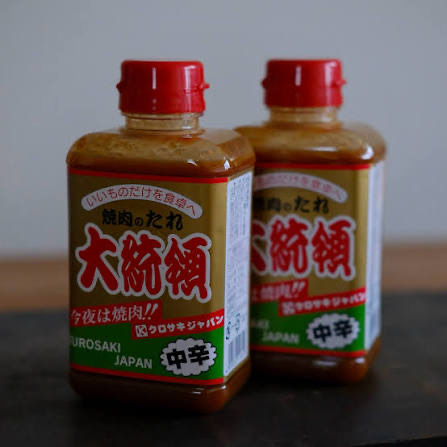

# 📍 8 天 7 夜大環線景點與名宿情報庫 (Spots Database)

> 收錄本次「山陰米子・境港 ➔ 柯南小鎮 ➔ 城崎溫泉・但馬 ➔ 海之京都天橋立・伊根 ➔ 鳥取砂丘 ➔ 岡山吉備津・倉敷」全程核心景點、名宿與 Google Maps 收藏景點情報。

---

## 🔍 1. 鳥取縣中西部：境港・米子・北榮町（柯南小鎮）

### 🕵️‍♂️ 【Google Maps 收藏】青山剛昌故鄉館 & 由良車站（柯南小鎮）
* **區域**：鳥取縣東伯郡北榮町
* **特色**：《名偵探柯南》作者青山剛昌先生的誕生地。整座城鎮化身為柯南迷朝聖樂園！
  * **由良車站（柯南站）**：月台、候車室、站前廣場皆有柯南彩繪與青銅像。
  * **青山剛昌故鄉館**：展示青山老師珍貴原稿、工作室復原場景、經典道具（蝴蝶結變聲器、太陽能滑板體感遊戲、阿笠博士黃色金龜車）。
  * **柯南大道**：全長 1.4 公里，沿途有少年偵探團雕像、柯南大橋與造型水溝蓋。
* **營業時間與搬遷風險（2026-09-25 查核）**：現行 09:30 - 17:30（最終入館 17:00）。[2026 年度休館表](https://www.gamf.jp/3539.html)只列 2027/1/29、2/26，未列本行程的 1/12；但館方[展覽文宣](https://www.gamf.jp/files/w021_2026031815461928404.pdf)另預告 2026 年度冬季為搬遷閉館，[新館公告](https://www.gamf.jp/3807.html)目標 2027 年春開幕。**2026-09-26 決定第二天不採用柯南中停**，本段保留作另次旅行參考。
* **門票**：現行大人 ¥700 / 中高生 ¥500 / 小學生 ¥300；外國旅客憑護照現行大人 ¥600。線上票現行於每月 1 日 10:00 開售下一個月，出發前重查是否售票與票種規則；未確認營業前不預購或計入必付預算。
* **電話**：0858-37-5389 ｜ **MapCode**：`189 685 869*47`

### 水木茂紀念館 & 水木茂大道
* **區域**：鳥取縣境港市；大道從境港站至紀念館約 800 公尺，現有 178 座妖怪銅像，妖怪神社沿路順遊。
* **紀念館**：現行 09:30～17:00、最終入館 16:30，全年無休；成人 ¥1,000。2027 臨時公告出發前複核。
* **Day 1**：御宿野乃官網列入住前寄物，但需旅館預先同意六件行李；寄物後 14:45～15:10 沿街到館，15:10～16:20 參觀，16:20～17:00 回程購物；預估無法 16:00 前入館則取消。紀念館亦有大件寄存，六件容量仍須先詢。夜遊 19:15～20:00，現行日落至 22:00 點燈，風雪或疲累縮為附近 15～30 分鐘。
* **餐飲**：等 JR 時先在機場簡餐；訂房不含晚餐（2026-09-26 確認），候選為館內自助（住宿客成人 ¥4,000、限量須事先聯絡）或境港站步行 8～15 分的和泉、海鮮ふぐ料理 殿。三案均未預訂，討論優先順序為和泉 → 殿 → 館內自助；比較表見 itinerary.md。現行入住 15:00／退房 11:00，大浴場 15:00～翌 10:00，早餐 06:30～09:30，Day 2 已含於訂房。
* **查核（2026-09-25）**：[紀念館](https://mizuki.sakaiminato.net/information/)／[紀念館寄物 FAQ](https://mizuki.sakaiminato.net/faq/)／[大道與夜間光影](https://mizuki.sakaiminato.net/road/)／[飯店餐飲](https://dormy-hotels.com/dormyinn/hotels/nono_sakaiminato/breakfast/)／[飯店寄物 FAQ](https://dormy-hotels.com/dormyinn/hotels/nono_sakaiminato/faq/)。水產直賣中心、美保關與夢港塔不列入第一天主行程。

### 境港大魚市場 / 境港水產直賣中心
* **區域**：鳥取縣境港市
* **特色**：日本頂級松葉蟹（紅楚蟹）與黑鮪魚產地，現場可現挑現蒸海鮮、品嚐鮮甜海鮮丼。

### 和菓子 壽城 (Kotobukijo)
* **區域**：鳥取縣米子市
* **特色**：米子城天守閣造型的銘菓殿堂，頂樓展望台眺望白雪大山。必吃名物為「栃餅（とち餅）」。

### 皆生溫泉 (Kaike Onsen)
* **區域**：鳥取縣米子市
* **特色**：面向美保灣與日本海的「海中湧出溫泉」，富含鹽分，具極佳保溫美膚效果。
* **Google Maps 標記名宿**：皆生松月 (Kaike Shogetsu)、華水亭 (Kasuitei)

---

## ♨️ 2. 兵庫縣但馬：城崎溫泉・玄武洞・出石城下町

### 👑 【已訂名宿】川口屋城崎河畔酒店 (Kawaguchiya Kinosaki Riverside Hotel)
* **住宿確認（2026-09-18 使用者提供）**：1/12 入住、1/14 退房，兩晚兩間房、含早晚餐、同房續住；實付、菜色與開席另核。現行入住 15:00～18:00、退房 10:00；站前旅館組合免費入住巴士到館約 5 分，旅館外湯送客巴士 15:00～17:00、20:00～21:00 每 30 分（只送不接）。[觀光協會旅館頁](https://resv.kinosaki-spa.gr.jp/kawagutiyariverside/)（2026-09-26）
* **官方網站**：[https://www.kawaguchiya.co.jp/](https://www.kawaguchiya.co.jp/)
* **電話**：0796-32-2611 ｜ **地址**：兵庫県豊岡市城崎町湯島880-1 ｜ **MapCode**：`672 506 881*01`
* **亮點**：大谿川與圓山川畔位置、定時外湯送客服務、多款花色浴衣租借與頂樓貸切展望露天風呂。菜色、房型、接站與貸切風呂條件均以訂房方案為準，不預設松葉蟹或但馬牛。

### 城崎溫泉外湯巡禮（含 Google Maps 收藏）

> 🔴 **さとの湯（里之湯）自 2024-03-31 起長期休館，尚未公布重開日期**，城崎目前是**六座**外湯，不是七座。
> **下表保留 2026-09-12 查核紀錄；2026-09-19、09-26 均未能重新讀出 2027 一月表**（定休日與營業時間於 09-26 對照觀光協會頁面一致）。✅ 為舊紀錄當日未列休湯，不是本次重新確認或保證營業；出發前複核。[城崎町湯島財產區年度休館表與公告](https://kinosaki-onsen.wixsite.com/kinosaki-onsen)、[外湯營業時段](https://kinosaki-spa.gr.jp/about/spa/)。

| 外湯 | 定休日 | 營業時間 | 1/12（二） | 1/13（三） |
| :--- | :--- | :--- | :---: | :---: |
| 鴻之湯（こうの湯） | 週二 | 7:00~23:00 | 🔴 表列休湯日 | ✅ 表內未列休湯；實際復業仍核 |
| 一之湯（いちの湯） | 週三 | 7:00~23:00 | ✅ | 🔴 固定休湯日 |
| 御所之湯（ごしょの湯） | 週四 | 7:00~23:00 | ✅ | ✅ |
| 曼陀羅湯（まんだら湯） | 週三 | 15:00~23:00 | ✅ | 🔴 固定休湯日 |
| 柳湯（やなぎ湯） | 週四 | 15:00~23:00 | ✅ | ✅ |
| 地藏湯（じぞう湯） | 週一 | 7:00~23:00 | ✅ | ✅ |
| ~~里之湯（さとの湯）~~ | **長期休館中** | — | 🔴 | 🔴 |

* **鴻之湯（こうの湯）**：城崎最古老源泉，傳說鸛鳥療傷之處，祈求夫婦圓滿、長壽。露天庭園湯；整修公告預計 2026 年 11 月重開，不將當前休館延用至 2027，也不把預計重開視為已復業。
* **【Google 收藏】曼陀羅湯（まんだら湯）**：相傳由道智上人誦念曼陀羅千日湧出之靈湯，唐破風寺院式外觀，陶器風呂。
* **御所之湯（ごしょの湯）**：綠意庭園露天風呂，被譽為美人之湯。
* **一之湯（いちの湯）**：天然洞窟風呂，祈求開運與合格。
* **柳湯（やなぎ湯）**：柳樹下的小巧木香深湯。
* **地藏湯（じぞう湯）**：家運隆盛之湯，營業時間最長（7:00~23:00），晚歸也泡得到。

**Day 3 用法**：外湯只固定一座，優先御所之湯；擁擠時改地藏湯或 15:00 後柳湯。御所之湯與柳湯在 1/14 表列休湯，適合 1/13 評估；第二座僅加選。最終入場為閉湯前 30 分鐘，續住外湯券效期先向川口屋確認。

### Day 3 纜車與午餐補充（2026-09-25 複核）

* **纜車**：山頂往返成人 ¥1,200，六人 ¥7,200；09:30 步行出發，目標 10:30 上山、11:10 下山，另留約 30 分鐘給六人登階、購票與候車。登入口至山麓站仍有 97 階樓梯；階梯濕滑、風雪大或步行不適合就取消登高，改平地散步、咖啡與外湯。可請川口屋代詢纜車公司 9 人座接客車；依交通與供車情況，不保證六人有位，費用另問。僅接客、不提供回送，也不免除登車前樓梯。未確認前維持步行規劃。
* **午餐**：海中苑本店為午餐候選：觀光協會現列 10:00～18:45（最後點餐 18:00），固定休業 1/1、1/2；2027/1/13 營業與六人座位另核。同品牌「魚屋のおにぎり」週三休，不當作當日外帶備案。
* **外湯資料邊界**：既有 2026-09-12 查核紀錄記載曾核對 2027 一月表；本次 2026-09-19 未能從官方日曆頁重新讀出該表，故不將舊紀錄當作本次再次確認。依現行固定休湯規則，週三一之湯、曼陀羅湯休；御所之湯優先、地藏湯或 15:00 後柳湯備選。御所之湯、柳湯週四休，適合今天評估；2027 當日及臨時異動仍須複核。
* **來源**：[纜車班次與票價](https://www.kinosaki-ropeway.jp/ropeway/)／[97 階與接客車 FAQ](https://www.kinosaki-ropeway.jp/qa/)／[海中苑本店](https://kinosaki-spa.gr.jp/directory/kaichuen-honten/)／[飯糰店週三休](https://okesyo.com/pages/onigiri)／[外湯公告](https://kinosaki-onsen.wixsite.com/kinosaki-onsen)／[外湯固定休湯](https://kinosaki-spa.gr.jp/about/spa/)／[川口屋館內](https://www.kawaguchiya.co.jp/kannai/index.php)。

### 🗿 【Google Maps 收藏】玄武洞公園 & 玄武洞博物館
* **區域**：兵庫縣豐岡市
* **特色**：
  * **玄武洞公園**：160 萬年前火山噴發冷卻形成的六角形柱狀玄武岩奇觀，世界地質公園核心，並為地球磁場「玄武地磁極性反轉」發現地。
  * **玄武洞博物館**：館內收藏世界各地珍奇礦物、寶石、巨型水晶、恐龍化石與但馬傳統工藝杞柳細工。
* **現行參考**：公園成人 ¥500（9:00~17:00、16:30 後不可入園；通常 12/29~1/3 休園）。但 2026 年一月另有週三臨時休園，**2027/1/13 是否開園尚待公告**。
* **玄武洞博物館（玄武洞ミュージアム）**：現行成人 ¥800；週三休館的慣例與年曆均可能調整。**2027 年年曆未公布，不列入 Day 3 主行程。**

**Day 3 用法**：僅作城崎上午活動的替代。2026/4 平日公園往城崎為 12:07 或 15:08，13:11 是往豐岡；2027 開園與回程未確認就不採用。巴士套票現行 ¥1,000 已含公園，不重複計 ¥500 門票；另詢六人預約計程車時，先確認開園與接回。來源：[公園](https://genbudo-park.jp/)、[全但巴士](https://www.zentanbus.co.jp/ticketinfo/genbudo-casual-tt/)（2026-09-12）。

**冬季交通補充（2026-09-12）**：直達巴士「玄武洞公園」站不需渡河，與 JR「玄武洞站」不同；渡船開館日依預約運行、荒天可停航，不列 Day 3 預設交通。博物館商店有叫車電話，但不保證當天開門或即時有六人車；計程車去回先約好，不以指南 ¥1,800 當作團體報價。[業者公告](https://genbudo-museum.jp/news/2625/)

### 但馬小京都・出石城下町 (Izushi)
* **區域**：兵庫縣豐岡市出石町
* **特色**：江戶時代城下町風情，地標為日本最古木造鐘樓「辰鼓樓」。必嚐傳統小碟「出石皿蕎麥麵」。

---

## 🌊 3. 京都府北部：海之京都（天橋立・伊根町）

### 日本三景 天橋立 (Amanohashidate)

* **Day 4 已選 B 天橋立（使用者確認）**：保留川口屋早餐，現行鐵路示例 11:05 抵達，2027 待核。文珠荘寄物與午餐後約 13:00–14:15 去 View Land 飛龍觀，14:15–15:15 走智恩寺與松林短線；**不去伊根**。雪況或臨時停駛時改平地短遊。伊根遊船與早抵雙景僅保留未採用備查。
* **特色**：日本三大名景之一，全長 3.6 公里沙洲，生長 8,000 多棵松樹。
* **傘松公園（北側・昇龍觀）**：倒過來從胯下看（股のぞき），沙洲如青龍騰飛。
  * 纜車約 4 分、現行往返 ¥800，12–1 月 09:00–17:00。**吊椅 1/6–2 月底僅週末／假日運行，1/14（四）不排**；仍查臨時運休。[官方纜車／吊椅](https://www.tankai.jp/trip/cable/)
  * Day 4 Plan A 未採用備查：原案須早抵且接續成立，寄物後巴士 10:58→11:24，登高＋午餐後接 13:29→13:58 日出碼頭；已選 B 不走此動線。
  * **更正「一月觀光船停航」**：季節時刻不足以證明一月全部停航。文珠～一の宮航線的 2027/1/14 船班尚未核實，暫用已公布巴士，不直接套夏季船表。[丹海天橋立船](https://www.tankai.jp/trip/amaboat/)
* **天橋立 View Land（南側・飛龍觀）**：天橋立站步行可達，單軌電車或吊椅登文珠山。現行 11/16~2/15 售票 9:00~16:30、設施至 17:00；往返現行 ¥1,000。1/14 未列於 2027 年 1/20~21 的保養停駛日，仍需出發前確認。
* **智恩寺 (文殊堂)**：供奉掌管智慧的文殊菩薩，扇子造型籤詩。

### 伊根舟屋群 (Ine Funaya)
* **特色**：米其林二星評價水上村落，230 棟舟屋緊鄰海面。
* **Day 4 已選 B 不去伊根**：下列伊根資訊只供日後改選備查，不列入本次路線、費用或必買項目；舟屋為私人住宅，不擅入。
* **伊根灣遊覽船（未採用備查）**：現行成人 ¥1,200、約 25 分，荒天可停航；已選 B 不搭船。原 13:03 去、14:30 船、15:12 回的巴士與船班需在日後改選時重查。[船公司](https://www.tankai.jp/trip/ineboat/)／[當期平日巴士](https://www.tankai.jp/routebus/timetable/?d=weekday&id=17892)
* **向井酒造**：現行週四、年末年始休息，**1/14 移除入店／試飲**；「伊根滿開」可詢日出碼頭商店，庫存待核。[伊根町觀光協會](https://www.ine-kankou.jp/shop/mukai-brewery)
* **INE CAFE**：位於平田「舟屋日和」，現行 10:30–17:00、L.O.16:30；2027 營業與六人候位待核。若優先街景／咖啡，取代船並另核街區車站與回程，不套日出時刻。[店家情報](https://www.ine-kankou.jp/taste/ine-cafe)
* **文珠荘已訂（2026-09-27 使用者確認含 Day 4 晚餐及 Day 5 早餐；房型待回填）**：入住前可寄物、站接送需預約、退房 10:00；一般入住 15:00–18:00，晚於 18:00 須聯絡。晚餐已含，開席現行 18:00／18:30／19:00，實際時段依訂位確認。[旅館 FAQ](https://www.monjusou.com/08qa/index.html)

---

## 🐪 4. 鳥取縣東部：鳥取市（鳥取砂丘・白兔神話）

### 鳥取砂丘
* **特色**：日本最大的觀光砂丘。一月若逢飄雪，呈現「雪白與黃沙交融」的景色。登上馬背俯瞰日本海。
* **砂之美術館：Day 5 不排入館。** 官方第 17 期西班牙展至 **2027/1/3**；FAQ 說明展期間隔為製作／整備休館，1/15 不計門票，後續特別開放仍依公告。不泛指每年固定開閉館日。[展覽](https://www.sand-museum.jp/schedule/event/list/default/)／[FAQ](https://www.sand-museum.jp/faq/)
* **冬季鞋具**：自備防水、防滑鞋及替換襪。遊客中心明載不借長靴／涼鞋；周邊店家的尺寸、價格與歸還時間另核，不再保證砂丘會館 ¥200～300 租借。[遊客中心 FAQ](https://www.sakyu-vc.com/jp/faq/)
* **遊客中心**：現行 09:00～17:00、免費，冬季 12～2 月第二個週三休館；1/15 週五仍查臨時公告。[官方觀光站](https://www.torican.jp/spot/detail_1002.html)
* **Day 5 已選 A′ 節奏**：文珠荘已含早餐後出發，現行示例 14:00 到鳥取；六件行李若能 14:30 前寄妥並回站，才搭 14:40→15:02 巴士，15:05～15:50 砂丘入口短線、16:20 回。風雪大或寄物來不及就取消砂丘，直接入住觀水庭；積雪景色不保證。
* **Day 5 減項（2026-09-27）**：已選 A′ 錯過 14:40 巴士即取消砂丘，不搭更晚去程壓縮 16:20 回程。07:45 早班與白兔／城跡計程車 B 未採用，白兔與城跡不加進主案。[砂丘線](https://hinomarubus.co.jp/timetable_route/4185/)
* **已訂こぜにや的休息安排**：大浴場現行 13:00–24:00／06:00–09:15；住客免費貸切湯兩處，15:00–翌日 09:15、不採預約，依現場空位及入住說明使用。已訂方案不含餐，Day 5 晚餐與 Day 6 早餐自費。已選 A′ 現行 14:00 抵鳥取；接站受理 14:00–21:50 仍須預約，不預設六人與行李可及時接送。六件寄物與 14:30 前回站須先確認，否則取消砂丘。[旅館 FAQ](https://kozeniya.com/faq/)。

### Day 5 晚餐候選順序（均未訂位）

| 順位 | 店家 | 鳥取和牛 | 不吃牛肉者 | 狀態 |
| :--- | :--- | :--- | :--- | :--- |
| 1 | [炭火焼ジュジュアン](https://jujuan.net/menu/) | 萬葉牛／鳥取和牛 | 大山豚、鹿野地雞、海鮮 | 候選；六人席位待確認 |
| 2 | [焼肉牛王 鳥取駅北口店](https://gyuoh-kitaguchi.foodre.jp/) | 萬葉牛／鳥取和牛 | 豬、雞、海鮮 | 候選；六人席位待確認 |

兩店擇一，均為自費晚餐；菜單、2027/1/15 營業與實際供應出發前再核對。[牛王菜單](https://yakiniku-gyuoh.com/img/kitaguchi_food.pdf)。
### 白兔神社
* **特色**：因幡之白兔神話發源地，保佑良緣與健康。
* **Day 5 定位**：已選 A′ 不排白兔神社。舊早班 Plan B 需 13:30 前從鳥取出發，與已選 A′ 14:00 抵站不相容；優惠計程車資訊只留備查，2027 資格與供車亦未確認。[鳥取市公告](https://www.city.tottori.lg.jp/page/5330.html)
### 鳥取城跡／仁風閣展示館
* **Day 5 定位**：已選 A′ 不排城跡；舊計程車 Plan B 未採用。
* 🔴 **仁風閣本館長期整修。** 預計 2029 年重開，不列為本行程可入館景點；如有餘裕再確認仁風閣展示館的開放日與最終入館時間。

---

## 🍑 5. 岡山縣：岡山城・吉備路・倉敷美觀

### ⛩️ 【Google Maps 收藏】吉備津神社 & 吉備津彥神社
* **區域**：岡山市北區
* **特色**：
  * **吉備津神社**：桃太郎傳說模型「吉備津彥命」斬妖除魔的古老神社。本殿與拜殿獲評為**國寶建築**；最著名的是順應山勢起伏、長達 **360 公尺的壯麗木造長迴廊**，古木參天，意境極度幽遠。
  * **吉備津彥神社**：備前國一之宮，與吉備津神社是不同地點。Day 8 僅作短參拜條件案：採買完成、寄物確認、JR 能 11:15 前折返岡山且機場巴士接續成立才去；不順路直通機場。備前一宮站至正面鳥居官網約步行 3 分、六人抓 10 分；現行 06:00～18:00 開門，2027 臨時公告另核。[神社官方交通](https://kibitsuhiko.or.jp/access.html)
* **電話**：086-287-4111 ｜ **MapCode**：`19 462 764*52`
* **Day 6 已選 A′ 只排吉備津神社，不串吉備津彥。** 自費早餐後搭 10:02 超級因幡，現行示例 13:52→14:07 吉備線去、14:25～15:25 參拜、15:47→16:05 回岡山，16:30～17:00 採買大統領。岡山城與後樂園不排；2027 同日車次及六人指定席待核。現行一般參拜 05:00～18:00、御朱印至 16:00，不含御祈禱或鳴釜神事。[JR 去程](https://timetable.jr-odekake.net/train-timetable/138251?date=20260628)／[回程](https://timetable.jr-odekake.net/train-timetable/52591?date=20260713)／[神社 FAQ](https://www.kibitujinja.com/faq/)
* **文化財名稱修正：**國寶是本殿與拜殿；360 公尺廻廊是縣指定重要文化財，不稱「國寶迴廊」。[官方境內圖](https://kibitujinja.com/en/map/)

### 岡山城 (烏城) & 岡山後樂園
* **岡山城**：外壁塗黑漆的「烏城」，登頂遠眺旭川。岡山站搭路面電車至城下站，步行可達。
* **岡山後樂園**：名列日本三大名園，米其林三星大名迴遊式庭園。自岡山城走月見橋即到。
  * **冬季（10/1~3/19）8:00~17:00，入園至 16:45。**
* **門票（2026/9/12 核）：**岡山城一般成人現行 ¥500；後樂園一般成人 ¥500、城園共通券 **¥800**，此為重新核對的現行價，不是因調價就推定失效。2027 仍複核；學生及 65 歲以上先比個別券與證件規定，不一律買共通券。[城調價](https://okayama-castle.jp/2938/)／[園與共通券](https://okayama-korakuen.jp/goriyo/441.html)
* **Day 6 緩衝：**已選 A′ 不排岡山城與後樂園，午餐後直接搭現行示例 13:52 吉備線去吉備津。城園的早班 A／市區 B 時段僅為未採用備查，不能併入已選行程。
* ⚠️ 舊城園案若日後改選，由後樂園前往吉備津神社需回岡山站轉 JR 吉備線，**全程近一小時**；已選 A′ 從岡山站直接出發。

### 倉敷美觀地區
* **特色**：江戶時代天領白壁土藏建築，倉敷川柳樹小舟漫遊、大原美術館（莫內《睡蓮》）、阿智神社。
* **Day 7 已選倉敷散步**：川舟不搭，蒜山高原確定不去；09:30～10:30 運河與白壁街區散步，接著大原美術館、午後 Outlet。原本尚未訂川舟票，行程不保留現場候補，預算不列船費。
* **大原美術館**：🔴 **冬季（12、1、2 月）開館時間縮短為 9:00~15:00**（其他月份 9:00~17:00）。
  休週一（遇假日開館），一般 ¥2,000、最終入館 14:30；2026-09-25 複核官方 2026 年度日曆（含 2027 年 1 月）：1/17 未列休館，1/12–15 列休館；冬季 09:00–15:00、最終入館 14:30，仍查臨時異動。 [年度日曆](https://www.ohara.or.jp/cms/wp-content/themes/ohara/images/top/calendar_pdf/2026calendar.pdf)。分館長期休館，Day 7 10:30～12:20 以本館與工藝・東洋館為主，不保證特定作品展出或三館全看完。[官方](https://www.ohara.or.jp/visitor_info/)
  * ⚠️ 本館曾於 2026/2/9~4/24 進行改修長期休館，期間已過，出發前仍應確認無新工程。
* **前往鷲羽山**：倉敷不在瀨戶大橋線上，需經岡山或茶屋町轉乘至児島站，再轉下電巴士。現行夕景專車只在週五、週六與假日前夕運行，1/17 週日不能套用；一般循環巴士的 2027 去回與末班確認前，**不列為 Day 7 既定行程**。

### 🛍️ 【Google Maps 收藏】三井 OUTLET PARK 倉敷
* **區域**：岡山縣倉敷市（倉敷車站北口步行即達）
* **Day 7 採買**：14:30～16:45 為購物時段；美觀地區至站北口另留 30 分。商店現行 10:00～20:00，2027 臨時休館與店家另核；免稅及商品資格依出發時制度與個別店家，不稱全面適用。[官方營業資訊](https://mitsui-shopping-park.com/mop/kurashiki/hour/)

### 🌉 【Google Maps 收藏】瀨戶大橋（鷲羽山展望台）
* **區域**：岡山縣倉敷市兒島
* **特色**：日本第一座橫跨本州與四國的雙層鐵公路兩用宏偉巨橋。從鷲羽山展望台可俯瞰瀨戶內海多島美與瀨戶大橋的壯觀夕陽絕景。

### 岡山指定採買：大統領燒肉醬

**到店出示照片**：圖片由使用者提供（2026-09-20），標示「中辛」；照片有兩瓶不代表預定購買兩瓶。可向店員詢問：この写真の「大統領 焼肉のたれ・中辛」はありますか？（請問有照片這款大統領中辛燒肉醬嗎？）容量、瓶數及庫存待確認；下列うま口價格不是這款中辛的報價。

大統領燒肉醬為指定採買目標；使用者提供的採購辨識照標示「中辛」，紅瓶蓋、金色標籤、紅色「大統領」字樣及綠色下緣。容量、瓶數與店頭同款庫存待確認。候選店「晴れの国おかやま館」位於岡山市北區表町 1-1-22，現行 10:00–18:00、週二休；網店列名作大統領うま口 400g 含稅 ¥594，僅作參考品，不代替指定同款。實體店庫存、同款與 2027 價格須先詢問（086-234-2270），未訂購／未保留。 [商品頁](https://www.okayamakan.or.jp/products/detail/1631)／[店鋪資訊](https://www.okayamakan.or.jp/help/about)／[製造商品項](https://www.kurosakijapan.com/shop-1)（2026-09-19 查核）。兩案均安排：Plan A 12:15～13:00 含後樂園至表町步行；Plan B 16:00～16:25 步行、16:25～16:55 採買，再回酒店；第七天維持倉敷，不預設 Outlet／Ario 有售。

### Day 8 站前收尾與採買（2026-09-20）

推薦 10:00～11:00 在さんすて岡山按清單收尾；一般商店現行 10:00～20:00、伴手禮／便當區部分 07:00～21:00，各店及 2027 再核。不追加表町追貨、AEON 或跨區景點。大統領優先第六天完成，前晚包好安排託運；第八天 11:45～12:10 回館取物裝箱。吉備津彥仍為條件案，非主行程。[商場](https://sun-ste.com/okayama-ichibangai/)／[液體規定](https://www.okayama-airport.org/faq/aircraft)。
